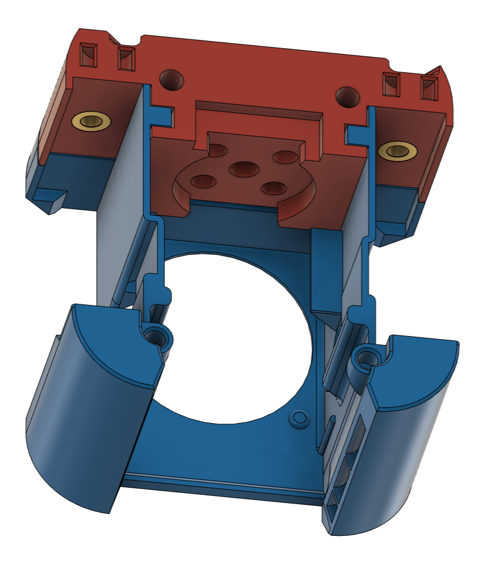
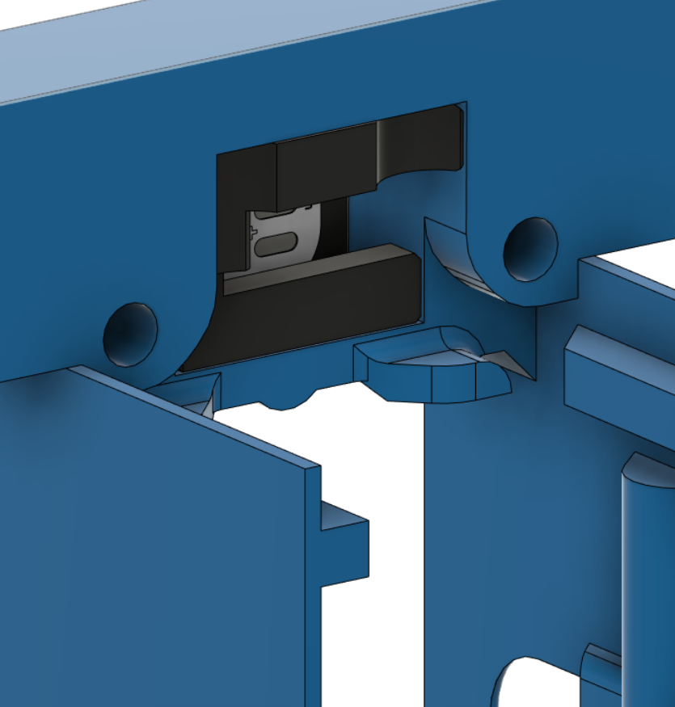
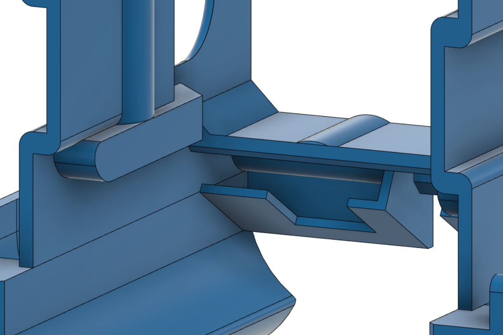
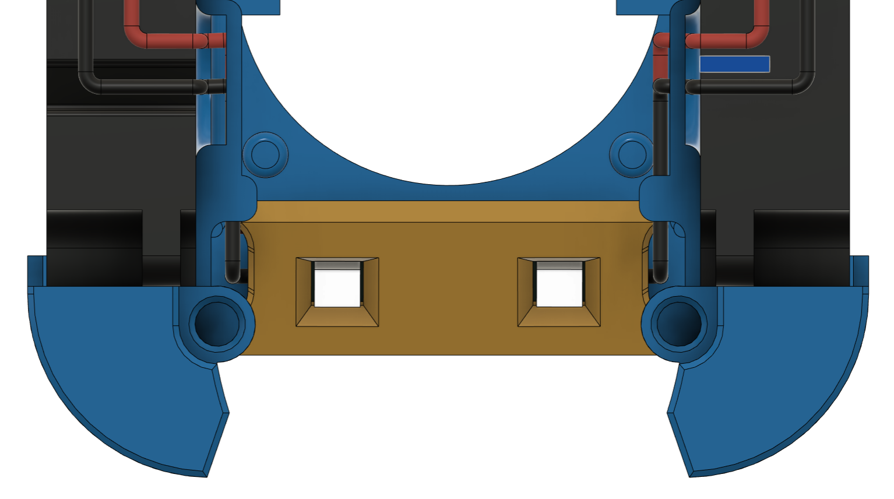
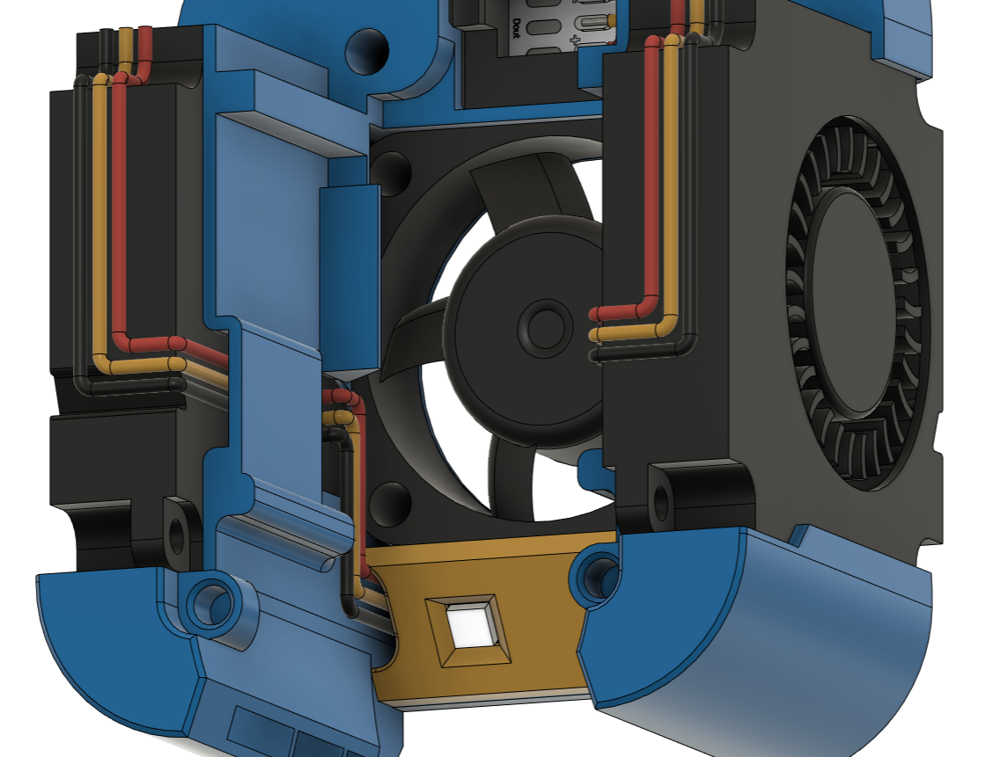
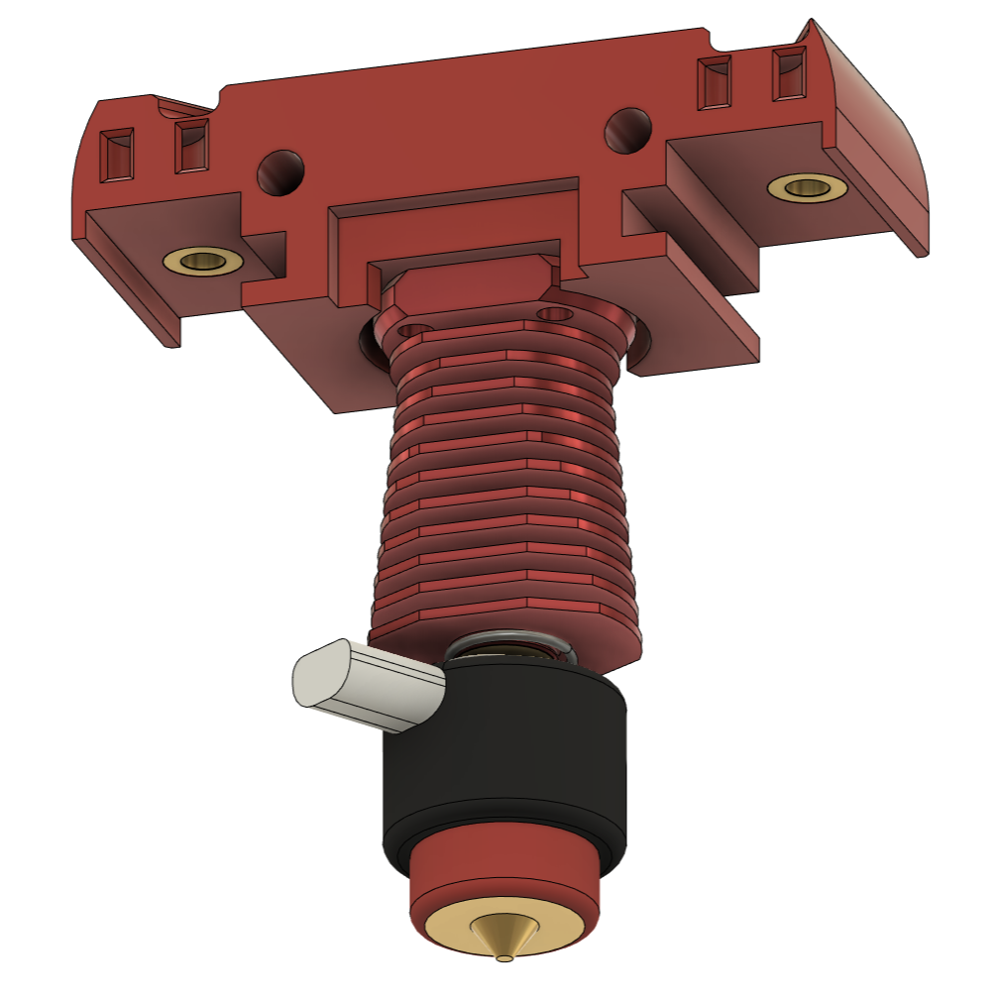
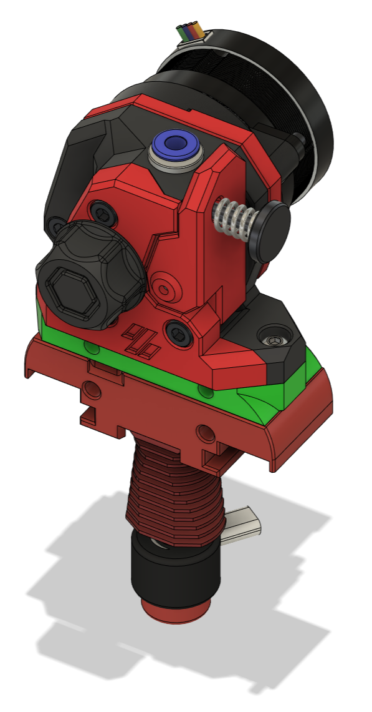

# Dragon Burner v5

This is a toolhead for the v0.2 Voron printer. It will also work on the various [Printers for Ants](https://3dprintersforants.com/).

This toolhead improves the cooling of the Dragon HF hotend and provides much improved part cooling when printing filament that needs it (e.g. PLA). Designed to use 2 4010 blower fans for part cooling and a 3010 fan for hotend cooling.

It supports Nozzle and Logo mounted LED's.


## Notes:

This version no longer supports the v0.1 X -carriage. This means that to use this release you will need to do the minimal upgrade from v0.1 to v0.2 of either:

New X Carriage, new X/Y joint tops and sensorless homing

or:

New X Carriage mod with built in microswitch for X available [here](https://www.printables.com/model/388228-voron-v02-x-carriage-w-endstop).

The toolhead currently stays within the v0.1 width measurements, so there's no loss in X if you don't change the X/Y joint tops.

You can also continue to use the [Dragon Burner v4](https://github.com/chirpy2605/voron/tree/main/V0/Dragon_Burner/Old_Versions/v4).

### Hotend support:

- Dragon SF and HF hotend support
- Dragonfly hotend support
- Revo Voron hotend support
- Rapido HF hotend support
- NF Crazy hotend support

### Extruder support:

- LGX Lite extruder support
- Sherpa Mini extruder support
- Sherpa Micro extruder support
- Sailfin/Sharkfin extruder support
- Orbiter v1.5 extruder support
- Orbiter v2 extruder support
- [RoundHouse extruder](https://github.com/waytotheweb/voron/tree/main/general/RoundHouse) support
- [RoundAbout extruder](https://github.com/waytotheweb/voron/tree/main/general/RoundAbout) support
- [RoundTrip extruder](https://github.com/waytotheweb/voron/tree/main/general/RoundTrip) support

### Fan support:

- Single 3010 24v hotend cooling fan
- Twin 4010 24v blower part cooling fans
- Screwless hotend fan attachment

### Probe support:

- [SlideSwipe magnetic probe](https://github.com/chestwood96/SlideSwipe) support
- [(Un)Klicky Probe](https://github.com/jlas1/Klicky-Probe) support
- [ZeroClick probe](https://github.com/zruncho3d/ZeroClick) support

### Extras:

- ADXL345 front mount (v0.1 only)
- Heatsink thermistor support
- Neopixel support (nozzle and logo)

## Printing:

- Use the Voron defaults and print in ABS/ASA or better. The parts are orientated correctly in the STLs
- Print the appropriate cowl for your sensor probe if you use one
- Print the appropriate hotend mount
- Print the extruder mount

Note: If using an Orbiter v1.5 extruder, you will need the extruder mount and the hotend mounts from the [STL Orbiter1.5 subdirectory](STLs/Orbiter1.5). With this extruder you loose the addition of the heatbreak thermistor.

Note: If using an Orbiter v2 extruder, you will need the extruder mount and the hotend mounts from the [STL Orbiter2 subdirectory](STLs/Orbiter2)

Note: If using an Sherpa Micro, you will need the extruder mount and the hotend mounts from the [STL Sherpa Micro subdirectory](STLs/Sherpa_Micro)

Note: If using the Sherpa Mini or a derivative, you will need the Sherpa_Mini_Mount.stl to clear the X carriage

## BOM:

- 2x M3x35mm SHCS/BHCS (2 for the X carriage mount)
- 2x M3x5x4mm heat inserts (2 for extruder mount)
- 2x M3x8mm SHCS/BHCS (2 for extruder mount)
- 1x M3x20mm SHCS/BHCS (for the rear of the v0.2 X carriage mount)
- 4x M2x10mm self tapping screws (for blower fans)
- 2x 4010 blower fans (24v recommended)
- 1x 3010 hotend fan (24v recommended)

The cowls support a no probe setup, [SlideSwipe magnetic probe](https://github.com/chestwood96/SlideSwipe), [(Un)Klicky Probe](https://github.com/jlas1/Klicky-Probe) and [ZeroClick probe](https://github.com/zruncho3d/ZeroClick)

## Fans:

I am using these fans:

- 24v Axial 3010: [Gdstime](https://www.aliexpress.com/item/1005002857100082.html)
- 24v Blower 4010: [Gdstime](https://www.aliexpress.com/item/32799324058.html)

## Heatsink Thermistor:

Each cowl includes a hole at the top to insert a thermistor. With this in place, klipper can track the temperature of the heatsink to watch for heat creep from the heatbreak. You can have klipper abort and shutdown before your whole toolhead melts! You only need a simple klipper entry for the appropriate pin on your MCU, e.g.:

```
[temperature_sensor Heatsink]
sensor_type: Generic 3950
sensor_pin: expander:PA5
max_temp: 85
```

Klipper will shutdown if the top of the heatsink hits 85C. You can use thermal paste to help keep a bulb thermistor in contact with the heatsink and route the wires through the provided groove, then fit the extruder on top to hold it in place.

## Assembly:


Add heat inserts into the hotend mount. Most mounts accept them from underneath, some need them from the top:



## LEDs:

Support has been added for either standard Neopixels or Sequins for the nozzle LEDs, Neopixels, Sequins and RainbowBarf for the Logo LED.

If you do not want to use the Logo LED you can fit the [a]_Carrier_Dummy.STL instead.

LED's are best cabled in series if they are addressable to allow independent control. For example, start with the (as seen from the front) right nozzle LED going to the left nozzle LED through the connecting gap, then up to the logo LED and back down and through the left cable channel to the back of the toolhead with the wire then extending up to the toolhead if you are using one.

### Logo LED:


You need to print the [c]_Diffuser.stl out of a transparent/translucent filament, such as natural ABS. You then will need to print the [o]_Carrier_[led type].stl of choice in an opaque filament to help prevent light bleed. The filament used to print the Cowl will likely be fine.

The LED is inserted into the side of the carrier. The diffuser sits inside the front of the carrier:


The logo unit is pushed into the cowl from the rear:


The cables route to the side of the inside of the cowl and then out through the cable channels to the rear:



### Nozzle Neopixels:

The LEDs can be fitted in series or parallel. If fitting in parallel, pass each one through from the wire channel into the cowling. Then twist the cables so that they are at 90 degrees from their pads (make sure the wires do not short themselves over each other) and push the LEDs into the slow with the wires coming out of the edge closest to the cable channels.

To fit in series, simply place an LED in each slot with the cable between them going across the bridge.

It's a bit of a tight squeeze, but they should slot in with a little manipulation and hold in place with friction and the wires once the fans have been attached.




### Nozzle Sequins:

Note: Use the Cowl_[probe]_Sequins.stl file for your chosen probe/noprobe

Sequins are fitted after soldering the cables to the sequins, but before crimping the cables. They can be fitted in series or parallel as explained in the Nozzle Neopixels section above.

Feed the sequin cables through the back of the sequin mount holes and then up and out through the cable channels in the cowl. You will need to secure the sequins with a dab of glue to prevent them from coming loose. Fitting the 4010 fans will then hold the cables in the channels in the cowl.



> **Credit to [MapleLeafMakers (Maple Leaf Makers) · GitHub](https://github.com/MapleLeafMakers) ("So I Says..." on the Voron Discord) for doing all the work on the Sequin integration.**

> **Credit to actualbigbobin (on the Voron Discord) for the original development and inspiration for the Logo LED.**

### LED Software:

To configure the Neopixels in Klipper, I'd suggest using the [[GitHub - julianschill/klipper-led_effect: LED effects plugin for klipper](https://github.com/julianschill/klipper-led_effect).

## Fans:

Insert the fans. You will need to release the cable from the tabs on the front-end 3010 fan. This is to allow the cable to be routed correctly. Care should be taken with the cables after doing this as too much movement could break off the wires from the fans.

If you are going to fit Neopixels, it's best to do that now (see bottom of page).

Fit the 3010 and 4010 fans that passing the connector and cable through the provided hole and along the outer channel. The 4010 fans will hold the wires in place in the channels:



The 3010 hotend fan is meant to be press fit. If it's too tight, sand or file the opening but don't force it in otherwise it can deform and the blades will hit the casing. If it's too lose or rattles, use electrical tape to slightly widen the fan. If the gap is too tight, file/sand down the ridges on the inside of the cowl opening to give the fan more room.

Use 4x M2x10mm self tapping screws to secure the fans into the cowl.

Attach the hotend to the hotend specific mount:



Attach the extruder to the extruder specific mount, shown here with the LGX Lite:



Mount the extruder to the hotend mount:


Offer up the cowl and extruder assembly to the X carriage and secure using 2 M3x35mm screws. Be careful not to catch any wires between the surfaces and that when the toolhead moves the X and Y axis endstops are triggered if you use them (e.g. on the stock v0.1). Also check that the X axis can move completely to the left:

Zip-tie the wires at the back of the assembly.

Plugin, test the fans and redo your X offset as it will likely have changed.

## ## v1 Changelog:

- 2022-04-12 First release
- 2022-04-12 Fixed issue with incorrect part placement
- 2022-04-13 Added mounts for the Dragonfly hotend
- 2022-04-13 Added mounts for the Rapido HF hotend
- 2022-04-13 Fixed clearance to socks on Rapido and Dragonfly
- 2022-04-16 Fixed misalignment of filament tube hole for Dragonfly
- 2022-04-16 New ducts improve airflow over nozzle
- 2022-04-19 New ducts improve airflow direction
- 2022-04-19 Added hole and wire groove for heatsink thermistor
- 2022-04-21 Added Klicky variant support
- 2022-04-21 Reorganised repo to separate hotends
- 2022-04-21 Added screwless 3010 hotend fan mount
- 2022-04-27 Added mounts for the E3D Revo Voron hotend
- 2022-05-07 Added wire exit for Klicky mount for all hotends
- 2022-05-08 Modified all toolheads to use removeable fan ducts
- 2022-05-10 Links to public Tinkercad added
- 2022-05-11 Updated Klicky fan ducts
- 2022-05-21 Added bridging supports to Klicky fan ducts
- 2022-06-03 Added ZeroClick variant support
- 2022-06-05 Easier to print fan ducts and magnet helper for ZeroClick

## Release v2:

- Redesigned in Fusion 360
- Integrated fan ducts
- Separate hotend mounts
- Redesigned part cooling fan ducts using CFD
- Significantly better airflow for part cooling
- Improved cable routing
- Improved documentation (with pictures!)
- Improved printability of all parts
- Improved duct design to provide more space for heater cartridges
- Improved support for RapidoHF

## v2 Changelog:

- 2022-08-27 v2 released
- 2022-08-28 Made a little more space for cabling
- 2022-08-28 Added NF Crazy mount and cowl changes (untested)
- 2022-08-28 Added Orbiter v2 support - mount and hotend mounts (untested)
- 2022-08-29 Added Orbiter v1.5 support - mount and hotend mounts (untested)
- 2022-09-21 Fixed ZeroClick cowl mount
- 2022-09-22 Released bowden mount
- 2022-09-25 Updated Dragon Mount. Increased depth to better cater for X carriage screws
- 2022-09-30 Updated all cowlings to help fix screws loosening over time
- 2022-11-23 Updated ADXL Mount (15mm between screws)
- 2022-11-24 Updated ZeroClick cowl to allow ADXL mount on the right side of the toolhead
- 2022-11-26 Updated all cowls to better hold the 4010 fans
- 2022-11-26 Updated ZeroClick mount
- 2022-11-29 Fixed some geometry issues with the hotend mounts
- 2022-11-29 Added a Sherpa Mini Mount

## Release v3:

- Improved geometry of hotend mounts

- Moved all hotend mounts to place the nozzle 2mm further forward to match the Mini AfterBurner - You will need to recalculate your Y limits to take advantage of this. The change should mean no loss of Y _unless_ banging on the door is an issue

- Added Sherpa Micro extruder support

- All hotend mounts have the heatsink thermistor functionality

## v3 Changelog:

- 2022-12-13 v3 released
- 2022-12-22 Added improved ADXL mounts (front and side)

## Release v4:

- New design

- Voron v0.2 support

- Improved cable routing space

- Additional M2x10mm self tapping screws to hold the 4010 fans in place

- All hotends align to the same location

- Improved rigidity of the toolhead

- Simpler mounting (removed 2 screws/inserts)

- Improved ZeroClick support

- Improved mounting screw depth 

- Where possible, moved the heat inserts to opposing plastic for better screw retention

- Adding bridge cutters where needed

- Removed side-mount ADXL mount in favour of the front mount on v0.1. v0.2 uses the mount on the back of the X carriage

## v4 Changelog:

- 2023-01-19 v4 released

- 2023-01-19 Fixed v0.2 RapidoHF and Revo Voron mounts

- 2023-01-19 Added M3x20mm screw to BOM for v0.2 X-carriage

- 2023-01-29 Fixed mainbody/nozzle alignment for v0.1 cowl

- 2023-01-31 Added sliders to the cowls and hotend mounts to help prevent the toolhead from tilting

- 2023-02-09 New cowls with experimental RGBW support

- 2023-02-09 Modified cowls to have two cable channels. Both channels are now deeper

- 2023-02-09 Modified v0.2 extruder mounts to extend the x-carriage rear screw distance to be a closer fit

- 2023-02-23 Fixed v0.1 hotend mounts so they meet the cowl correctly

- 2023-02-23 Made all the v0.2 extruder mounts flush with the x-carriage rear screw mount

- 2023-02-23 Added new cable routing system that allows the easy fitting and removal of part cooling fans and simple routing for LEDs

- 2023-02-23 Updated CAD with all the recent changes

- 2023-02-23 Changed LED configuration recommendation to [GitHub - julianschill/klipper-led_effect: LED effects plugin for klipper](https://github.com/julianschill/klipper-led_effect)

- 2023-02-23 Added Sequin cowls

- 2023-02-23 Modified Sequin cowls to restore through access for daisy-chained sequins

## Release v5:

For the initial release of v5, only the Cowl needs reprinting with the addition of the Logo LED carrier and diffuser. Subsequent changes may need additional parts reprinted.

- v0.2 X Carriage only support going forwards
- Added Logo LED support for Neopixel, Sequin or RainbowBarf
- Nozzle LEDs no longer experimental
- Widened the SlideSwipe magnets holes slightly to help prevent printed part splitting when inserting the magnets

## v5 Changelog:

- 2023-03-20 v5 released
