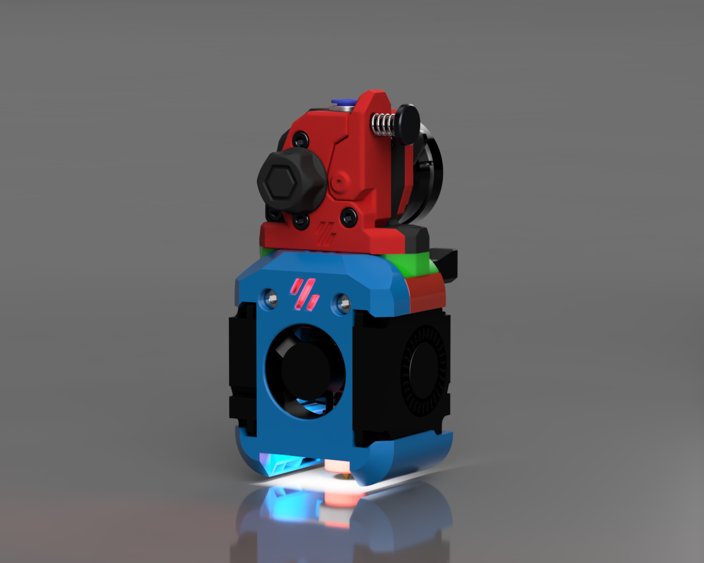
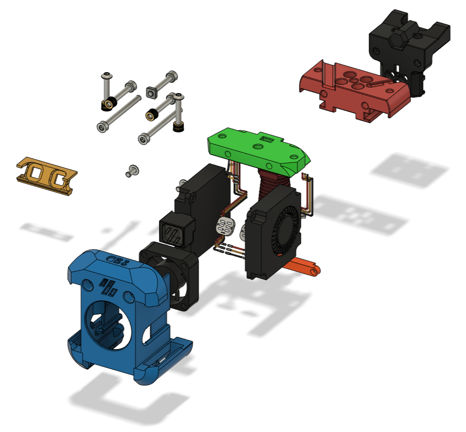
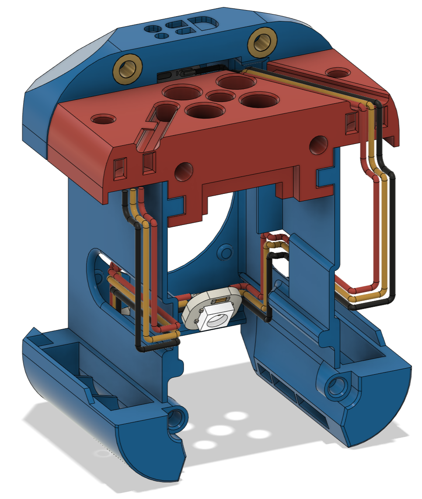
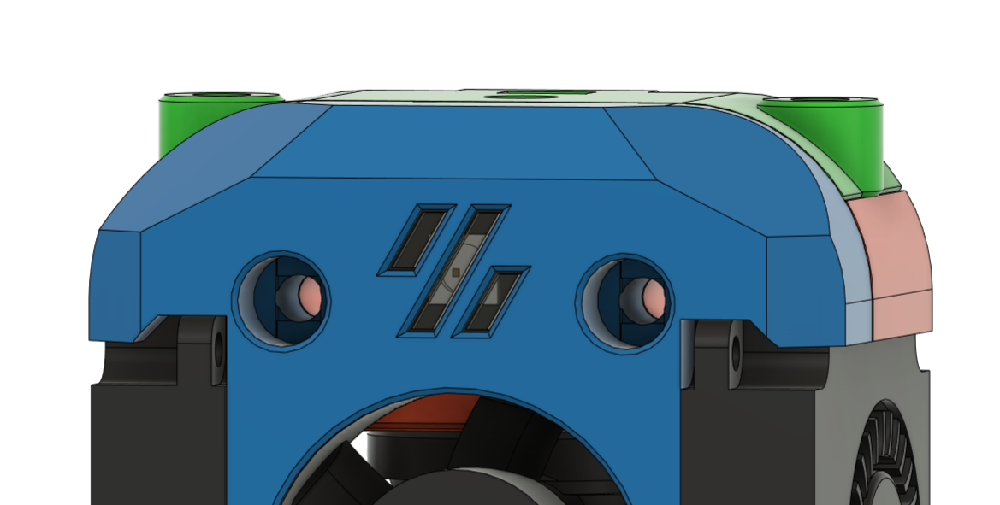
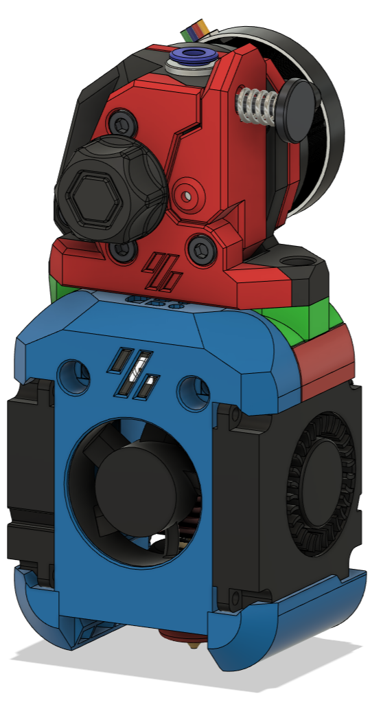
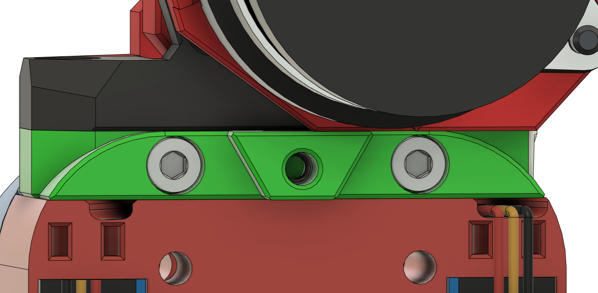
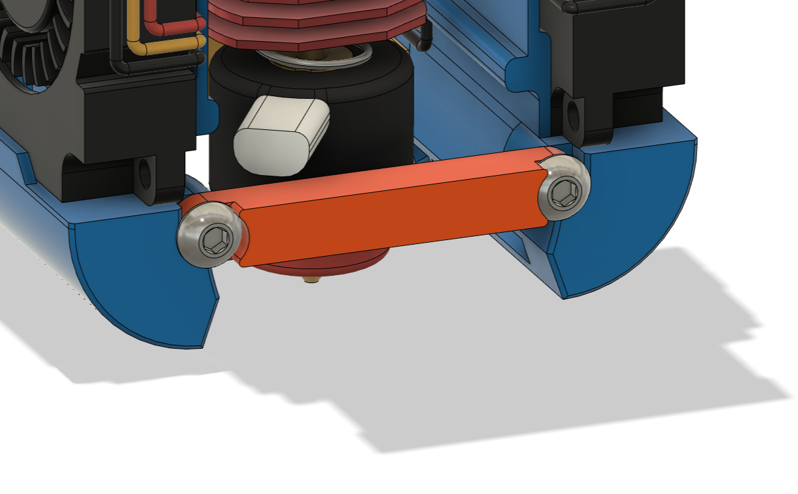
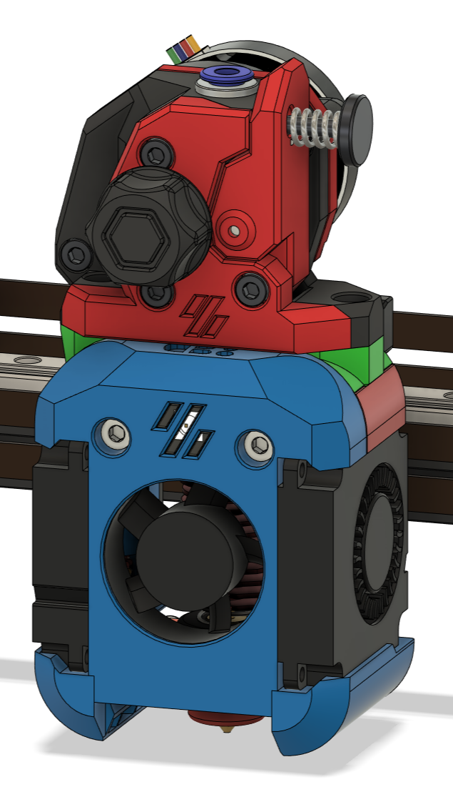
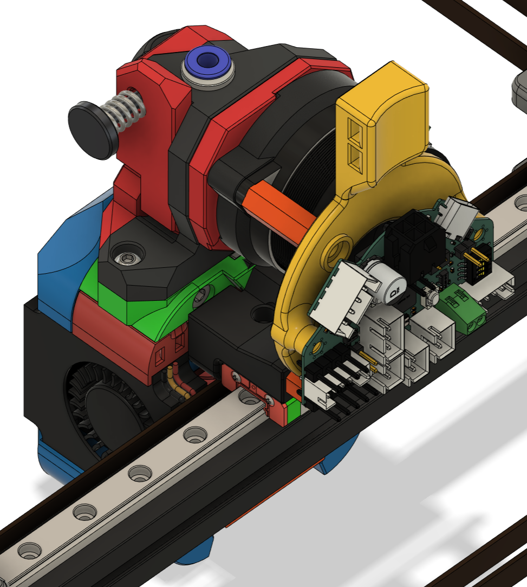

# Dragon Burner v8 (BETA)

**NOTE:** This is the v8 BETA release of this toolhead. There may be problems with STLs, documentation and fitment. Final release with CAD will come as soon as everything is stable

This is a toolhead for the v0.2 Voron printer. It will also work on the various [Printers for Ants](https://3dprintersforants.com/).

There are also [Mounts](https://github.com/chirpy2605/voron/tree/main/general/Large_Voron_Mounts) available to use this toolhead to the Voron Trident, v2.4, Switchwire and Legacy printers.

This toolhead improves the cooling of the hotend and provides much improved part cooling when printing filament that needs it (e.g. PLA). Designed to use 2 4010 blower fans for part cooling and a 3010 fan for hotend cooling.

It supports Nozzle and Logo mounted LED's.



---

* [Review by Maple Leaf Makers](#review-by-maple-leaf-makers)

* [CFD Analysis](#cfd-analysis)

* [Notes](#notes)

* [Hotend support](#hotend-support)

* [Extruder support](#extruder-support)

* [Fan support](#fan-support)

* [Probe support](#probe-support)

* [Extras](#extras)

* [Printing](#printing)

* [BOM](#bom)
  
  + [Hotend specific BOM](#hotend-specific-bom)

* [Fans](#fans)

* [Heatsink Thermistor](#heatsink-thermistor)

* [Assembly](#assembly)
  
  + [Heat Inserts](#heat-inserts)
  + [LEDs](#leds)
  + [Logo LED](#logo-led)
  + [Nozzle Neopixels](#nozzle-neopixels)
  + [Nozzle Sequins & Neopixel Sequins](#nozzle-sequins-neopixel-sequins)
  + [LED Software](#led-software)
  + [Fans](#fans-1)

* [PCB Mounts](#pcb-mounts)

* [Alternative Mounts](#alternative-mounts)

<!-- **Having trouble choosing the right STL's?** Tryout the [**Online STL Configurator**](https://chirpy2605.github.io/DragonBurnerConfig/#/) created by [Maple Leaf Makers](https://github.com/MapleLeafMakers) -->

---

## Review by Maple Leaf Makers:

[Voron Mod Showcase: Dragon Burner Toolhead - YouTube](https://www.youtube.com/watch?v=ooU3U1dBz1Q) (Dragon Burner v6).

## CFD Analysis:

There is a [document](cfd/) showing the development of the v8 part cooling ducts, describing the CFD analysis and test prints that went into making them.

## Notes:

On the Voron V0, this version only supports the v0.2 X -carriage.

You can also continue to use the [Dragon Burner v4](https://github.com/chirpy2605/voron/tree/main/V0/Dragon_Burner/Old_Versions/v4) for the v0.1 X -carriage.

### Hotend support:

- Dragon SF and HF
- Dragon + Volcano (Rapido HF mount)
- Dragonfly BMO
- Dragonfly BMS (7 fin)
- Revo Voron
- Rapido HF
- NF Crazy
- Creality Spider Pro
- Bambu Labs X1C
- TaiChi
- E3D V6 Groove Mount
- Red Lizard K1 Pro (Dragon mount)
- Red Lizard K1 UHF (Rapido HF mount)

Note: The [Rapid Burner](https://github.com/chirpy2605/voron/tree/main/V0/Rapid_Burner) toolhead supports the Rapido UHF and Dragon Burner UHF hotends.

### Extruder support:

- LGX Lite (use the Sherpa Mini hotend mount)
- Sherpa Mini
- Sherpa Micro
- Sailfin/Sharkfin
- Orbiter v1.5
- Orbiter v2
- Vz-HextrudORT (Uses the LGX Lite extruder mount and Sherpa Mini hotend mount)
- Double Folded Ascender
- [RoundTrip](https://github.com/waytotheweb/voron/tree/main/general/RoundTrip) (Gears from the LGX Lite, TBG Lite, Orbiter v1.5, Orbiter v2)
- Galileo v2 Standalone (G2SA) with specific mounts for Sherpa Mini and Orbiter v2 mount hole configurations

### Fan support:

- Single 3010 24v hotend cooling fan
- Twin 4010 24v blower part cooling fans
- Screwless hotend fan attachment
- Screwless part cooling fan attachment

### Probe support:

- [SlideSwipe magnetic probe](https://github.com/chestwood96/SlideSwipe) support
- [(Un)Klicky Probe](https://github.com/jlas1/Klicky-Probe) support
- [ZeroClick probe](https://github.com/zruncho3d/ZeroClick) support

For Klick support see following sites for implementation:

[Klicky-Probe/Printers/Voron/v0 at main · jlas1/Klicky-Probe · GitHub](https://github.com/jlas1/Klicky-Probe/tree/main/Printers/Voron/v0#integrated-cowling-v01)

[Klicky-Probe/Probes/KlickyNG at main · jlas1/Klicky-Probe · GitHub](https://github.com/jlas1/Klicky-Probe/tree/main/Probes/KlickyNG)

### Extras:

- ADXL345 front mount
- Heatsink thermistor support on most hotend mounts
- Neopixel support (nozzle and logo)
- Adafruit Sequin support (nozzle and logo)
- [Lab4450]([Shop - RGB Neopixel Sequins for Voron Mini SB - Lab4450.com](https://lab4450.com/product/rgb-neopixel-sequins/)) Neopixel Sequin support (nozzle and logo)

## Printing:

- Use the Voron defaults and print in ABS/ASA or better. The parts are orientated correctly in the STLs
- Print the appropriate cowl for your sensor probe if you use one
- Print the appropriate hotend mount
- Print the extruder mount
- Print a PCB [mount](https://github.com/chirpy2605/voron/tree/main/general/PCB_Mounts), if needed
- Print a v2.4, Trident, Switchwire, Legacy [mount](https://github.com/chirpy2605/voron/tree/main/general/Large_Voron_Mounts), if needed

## BOM:

- 2 x M3x35mm BHCS/SHCS to secure cowl to X carriage
- 1 x M3x20mm BHCS/SHCS to secure X carriage to toolhead from the rear
- 2 x M3x20mm BHCS to secure extruder mount to cowl
- 2 x M3x6mm BHCS to secure rear brace to lower cowl
- 2 x M3x(20mm or 18mm or 14mm) BHCS to secure extruder to hotend mount. Screw length depends on extruder and hotend mount
- 1 x M3 nut preferably preferably square over hexagonal to secure the 20mm screw through the X carriage to the rear of the toolhead
- 2 x M3x50mm BHCS/SHCS to secure ADXL mount through cowl to X carriage (optional, preference would be for a nozzle mounted ADXL)
- 2 x M3 brass heat inserts to secure extruder mount to cowl
- 2 x M3 brass heat inserts to secure extruder to hotend mount
- 2 x 4010 24v blower fans for part cooling
- 1 x 3010 24v axial fan for hotend cooling
- 3 x LEDs for logo and nozzle lights (optional, can be a mixture of NeoPixels and/or Sequins)
- 2 x 2.5mm nylon zip ties for cable management

#### Hotend specific BOM:

TaiChi:

- 2 x M3 brass heat inserts
- 2 x M3x18mm BHCS

v6:

- 2 x M3 brass heat inserts
- 2 x M3x16mm BHCS/SHCS

Bambu:

- 2 x M3 brass heat inserts

- 2 x M3x20mm BHCS/SHCS

- A variety of M3 SHCS or BHCS screws

- 2x 4010 blower fans (24v recommended)

- 1x 3010 hotend fan (24v recommended)

The cowls support a no probe setup, [SlideSwipe magnetic probe](https://github.com/chestwood96/SlideSwipe), [(Un)Klicky Probe](https://github.com/jlas1/Klicky-Probe) and [ZeroClick probe](https://github.com/zruncho3d/ZeroClick)

## Fans:

I am using and can recommend these fans:

- 24v Axial 3010: [Gdstime](https://www.aliexpress.com/item/1005002857100082.html)
- 24v Blower 4010: [Gdstime](https://www.aliexpress.com/item/32799324058.html)

## Heatsink Thermistor:

Each cowl includes a hole at the top to insert a thermistor. With this in place, klipper can track the temperature of the heatsink to watch for heat creep from the heatbreak. You can have klipper abort and shutdown before your whole toolhead melts! You only need a simple klipper entry for the appropriate pin on your MCU, e.g.:

```
[temperature_sensor Heatsink]
sensor_type: Generic 3950
sensor_pin: expander:PA5
max_temp: 85
```

Klipper will shutdown if the top of the heatsink hits 85C. You can use thermal paste to help keep a bulb thermistor in contact with the heatsink and route the wires through the provided groove, then fit the extruder on top to hold it in place.

## Assembly:




## Heat Inserts:

Add heat inserts into the hotend mount. Most mounts accept them from underneath, some need them from the top:


Add heat inserts to the inside of the cowl at the top for the extruder mount to screw in to:


## LEDs:

Support has been added for either standard Neopixels or Sequins for the nozzle LEDs, Neopixels, Sequins and RainbowBarf for the Logo LED.

If you do not want to use the Logo LED you can fit the [a]_Carrier_Dummy.STL instead and print an opaque diffuser.

LED's are best cabled in series if they are addressable to allow independent control.

There are 2 soldering jigs included in the repo, one for Neopixels and one for Sequins. They should help with soldering the wires for the nozzle lights with the correct gap space and can be used for the Logo LED as well.

The following is one solution to wiring the LEDs. There are a myriad of others, but this works relatively easily:




### Logo LED:



You need to print the [c]_Diffuser.stl out of a transparent/translucent filament, such as natural ABS. You then will need to print the [o]_Carrier_[led type].stl of choice in an opaque filament to help prevent light bleed. The filament used to print the Cowl will likely be fine.

The LED is inserted into the side of the carrier. The diffuser sits inside the front of the carrier:


The logo unit is pushed into the cowl from the rear:


### Nozzle Neopixels:

Fit the Neopixels into the neopixel carrier and then slot into the cowl being careful not to pinch any wires:


### Nozzle Sequins & Neopixel Sequins:

Fit the sequins into the sequin carrier and then slot into the cowl being careful not to pinch any wires:


### LED Software:

To configure the Neopixels in Klipper, I'd suggest using the [[GitHub - julianschill/klipper-led_effect: LED effects plugin for klipper](https://github.com/julianschill/klipper-led_effect).

## Fans:

Insert the fans. You will need to release the cable from the tabs on the front-end 3010 fan as well as the left part cooling 4010 fan. This is to allow the cable to be routed correctly. Care should be taken with the cables after doing this as too much movement could break off the wires from the fans. You can add cable relief with a dab of hot glue on the fan wire connections under the sticker.

Fit the 3010 fan by passing the connector and cable through the provided hole on the right and along the outer channel. The 4010 fans will hold the wires in place in the channels:


The 3010 hotend fan is meant to slide up from the bottom of the cowl and is friction fit in place. Once the toolhead is fully built it will be held sturdily in place.

There is also a 2510 fan spacer if you would prefer to use a smaller hotend fan.

Slide the 4010 fans into the cowl from the rear into the provided slots.

To provide more space for cables snip off the screw lugs at the top rear of the 4010 fans. On some makes of fan you can also trim more of the fan shroud if you look at the inside of the fan shroud, e.g. on the GDStime. This can make cable routing easier if you have problems:


Attach the hotend to the hotend specific mount:


Attach the extruder to the extruder specific mount into the hotend mount:


Mount the extruder to the hotend mount and slide the assembly onto the cowl taking care to fit the 4010 part cooling fans into the slots:




Next, screw the extruder mount to the cowl using 2 x M3x20mm screws (not available for all extruders). Do _not_ overtighten these screws or the PTFE tube could be deformed:



The rear brace should be fitted to the rear of the ducts using 2 x M3x6mm screws. These screw into plastic, so only lightly tighten. The screws don't provide the rigidity, the brace does, so no need to tighten much at all. Choose between the straight and the curved brace depending on which will better fit with your hotend. Not all hotend and carriage mounts will support using the rear brace:



Zip-tie the wires at the back of the assembly, ensuring the wires do not foul the X carriage.

Offer up the toolhead assembly to the X carriage and secure using 2 M3x35mm screws. Be careful not to catch any wires between any of the surfaces.





Check that when the toolhead moves, the X and Y axis end stops are triggered if you use them (e.g. on the stock v0.1).

On the v0.2 X carriage you can use a 20mm screw from the rear of the carriage into the corresponding  m3 nut inside the toolhead.

Plugin, test the fans and redo your X offset as it will have changed.

## PCB Mounts:

Mounts for various extruders and PCB mounts are [available](https://github.com/chirpy2605/voron/tree/main/general/PCB_Mounts).

## Alternative Mounts:

Mounts are available for [boop](https://github.com/chirpy2605/voron/tree/main/general/Experimental/Boop) as well as the [Large Vorons](https://github.com/chirpy2605/voron/tree/main/general/Large_Voron_Mounts), including mounts for [Tap](https://github.com/chirpy2605/voron/tree/main/general/Large_Voron_Mounts#option-2-tap-probe-front).

## Credits:

- [MapleLeafMakers](https://github.com/MapleLeafMakers) for doing all the work on the Sequin integration

- actualbigbobin (on the Voron Discord) for the original development and inspiration for the Logo LED

- [jlsa1](https://github.com/jlas1/Klicky-Probe/tree/main/Probes) and [MapleLeafMakers](https://github.com/MapleLeafMakers) and for the Integrated Klicky and KlickyNG probe ducts

- A big Thank you! to all those who sacrificed many prints and helped to develop v8 in the closed Beta

## v1 Changelog:

- 2022-04-12 First release
- 2022-04-12 Fixed issue with incorrect part placement
- 2022-04-13 Added mounts for the Dragonfly hotend
- 2022-04-13 Added mounts for the Rapido HF hotend
- 2022-04-13 Fixed clearance to socks on Rapido and Dragonfly
- 2022-04-16 Fixed misalignment of filament tube hole for Dragonfly
- 2022-04-16 New ducts improve airflow over nozzle
- 2022-04-19 New ducts improve airflow direction
- 2022-04-19 Added hole and wire groove for heatsink thermistor
- 2022-04-21 Added Klicky variant support
- 2022-04-21 Reorganised repo to separate hotends
- 2022-04-21 Added screwless 3010 hotend fan mount
- 2022-04-27 Added mounts for the E3D Revo Voron hotend
- 2022-05-07 Added wire exit for Klicky mount for all hotends
- 2022-05-08 Modified all toolheads to use removeable fan ducts
- 2022-05-10 Links to public Tinkercad added
- 2022-05-11 Updated Klicky fan ducts
- 2022-05-21 Added bridging supports to Klicky fan ducts
- 2022-06-03 Added ZeroClick variant support
- 2022-06-05 Easier to print fan ducts and magnet helper for ZeroClick

## Release v2:

- Redesigned in Fusion 360
- Integrated fan ducts
- Separate hotend mounts
- Redesigned part cooling fan ducts using CFD
- Significantly better airflow for part cooling
- Improved cable routing
- Improved documentation (with pictures!)
- Improved printability of all parts
- Improved duct design to provide more space for heater cartridges
- Improved support for RapidoHF

## v2 Changelog:

- 2022-08-27 v2 released
- 2022-08-28 Made a little more space for cabling
- 2022-08-28 Added NF Crazy mount and cowl changes (untested)
- 2022-08-28 Added Orbiter v2 support - mount and hotend mounts (untested)
- 2022-08-29 Added Orbiter v1.5 support - mount and hotend mounts (untested)
- 2022-09-21 Fixed ZeroClick cowl mount
- 2022-09-22 Released bowden mount
- 2022-09-25 Updated Dragon Mount. Increased depth to better cater for X carriage screws
- 2022-09-30 Updated all cowlings to help fix screws loosening over time
- 2022-11-23 Updated ADXL Mount (15mm between screws)
- 2022-11-24 Updated ZeroClick cowl to allow ADXL mount on the right side of the toolhead
- 2022-11-26 Updated all cowls to better hold the 4010 fans
- 2022-11-26 Updated ZeroClick mount
- 2022-11-29 Fixed some geometry issues with the hotend mounts
- 2022-11-29 Added a Sherpa Mini Mount

## Release v3:

- Improved geometry of hotend mounts

- Moved all hotend mounts to place the nozzle 2mm further forward to match the Mini AfterBurner - You will need to recalculate your Y limits to take advantage of this. The change should mean no loss of Y _unless_ banging on the door is an issue

- Added Sherpa Micro extruder support

- All hotend mounts have the heatsink thermistor functionality

## v3 Changelog:

- 2022-12-13 v3 released
- 2022-12-22 Added improved ADXL mounts (front and side)

## Release v4:

- New design

- Voron v0.2 support

- Improved cable routing space

- Additional M2x10mm self tapping screws to hold the 4010 fans in place

- All hotends align to the same location

- Improved rigidity of the toolhead

- Simpler mounting (removed 2 screws/inserts)

- Improved ZeroClick support

- Improved mounting screw depth 

- Where possible, moved the heat inserts to opposing plastic for better screw retention

- Adding bridge cutters where needed

- Removed side-mount ADXL mount in favour of the front mount on v0.1. v0.2 uses the mount on the back of the X carriage

## v4 Changelog:

- 2023-01-19 v4 released

- 2023-01-19 Fixed v0.2 RapidoHF and Revo Voron mounts

- 2023-01-19 Added M3x20mm screw to BOM for v0.2 X-carriage

- 2023-01-29 Fixed mainbody/nozzle alignment for v0.1 cowl

- 2023-01-31 Added sliders to the cowls and hotend mounts to help prevent the toolhead from tilting

- 2023-02-09 New cowls with experimental RGBW support

- 2023-02-09 Modified cowls to have two cable channels. Both channels are now deeper

- 2023-02-09 Modified v0.2 extruder mounts to extend the x-carriage rear screw distance to be a closer fit

- 2023-02-23 Fixed v0.1 hotend mounts so they meet the cowl correctly

- 2023-02-23 Made all the v0.2 extruder mounts flush with the x-carriage rear screw mount

- 2023-02-23 Added new cable routing system that allows the easy fitting and removal of part cooling fans and simple routing for LEDs

- 2023-02-23 Updated CAD with all the recent changes

- 2023-02-23 Changed LED configuration recommendation to [GitHub - julianschill/klipper-led_effect: LED effects plugin for klipper](https://github.com/julianschill/klipper-led_effect)

- 2023-02-23 Added Sequin cowls

- 2023-02-23 Modified Sequin cowls to restore through access for daisy-chained sequins

## Release v5:

For the initial release of v5, only the Cowl needs reprinting with the addition of the Logo LED carrier and diffuser. Subsequent changes may need additional parts reprinted.

- v0.2 X Carriage only support going forwards
- Added Logo LED support for Neopixel, Sequin or RainbowBarf
- Nozzle LEDs no longer experimental
- Widened the SlideSwipe magnets holes slightly to help prevent printed part splitting when inserting the magnets

## v5 Changelog:

- 2023-03-20 v5 released

## Release v6:

- Improved printability of the top front corners of the cowl

- Added support for [Lab4450]([Shop - RGB Neopixel Sequins for Voron Mini SB - Lab4450.com](https://lab4450.com/product/rgb-neopixel-sequins/)) Neopixel Sequins

- Added part cooling fan guides to better seat the fan against the ducts

- Removed the need for part cooling fan screws

- Removed part cooling fan screw nubs to support a wider range of 4010 blowers

- New ducts that are wider to help prevent melting when using v6 type heater blocks (e.g. Dragon hotends)

- New ducts with improved airflow and concentration

- Improved Neopixel fitting with cable routing cutout

- Added Creality Spider Pro hotend support

- Various cowl geometry fixes

- Confirmed support for the Vz-HextrudORT extruder (uses the LGX Lite extruder mount)

- Added a 2015 hotend fan adapter

## v6 Changelog:

- 2023-04-29 v6 released
- 2023-05-23 Centred Logo correctly (for hartk)
- 2023-05-23 Added sacrificial cutouts to the Sequin Cowls to allow installation and removal of sequins without damaging the cowl or sequin wiring
- 2023-05-23 Added more space for the Dragon hotend sock
- 2023-05-23 Added more space for the 3010 hotend fan to seat fully
- 2023-05-23 Lengthened the hotend mount rails to help prevent the cowl sides from splitting easily
- 2023-05-23 Improve channels for Neopixel cables to help prevent plastic tabs from breaking off
- 2023-05-23 Updated CAD
- 2023-05-26 Added extruder support for Double Folded Ascender
- 2023 06-23 Added integrated Klicky probe cowls
- 2023 06-23 Added KlickyNG probe cowls

## Release v7:

- New aesthetic for the toolhead

- Hotend moved back by 2mm to be closer to the stock toolhead position

- All new fan ducts. Size increase by 60% and tuned with CFD to improve part cooling

- Bambu Labs X1 hotend support

- Phaetus Taichi hotend support

- LED mounts separated from cowl to reduce number of cowls required and improve ease of installation and removal of the LEDs

- 3010 hotend fan placed inside of the cowl

- 3010 hotend fan position raise to better target cooling and improve support for volcano height hotends such as the Rapido HF and the Dragon + volcano heat block (without extender). This replaces the support for those hotends from the Rapid Burner

- Right hand cable channel reduced in width to allow support for the Bambu Labs X1 hotend. This means that bundles of wire, e.g. LED wires, should be routed through the left hand channel

- Improved Bowden mount that uses ECAS 4mm PTFE retainer and improved strain relief

- Removed the 4010 retainer lug on the cowl and lengthened to retaining guides to hold those fans in place

- Removed unnecessary self tapping screw holes from the cowls

- Updated the KlickyNG cowl orientation

- Modified the ZeroClick cowl to have an integrated mount and include replacement shorter Z rail stops

- Added fan air redirection fins to all cowls to help with hotend cooling

- Added E3D V6 hotend support

- Added Orbiter v1.5 2.85mm filament support for E3D V6 hotend

- Added shortened rail stops for ZeroClick cowl

## v7 Changelog:

- 2023-07-08 v7 released
- 2023-07-11 Fixed hotend mount geometry
- 2023-07-12 Updated CAD
- 2023-07-15 Added link to the [**Online STL Configurator**](https://chirpy2605.github.io/DragonBurnerConfig/#/)
- 2023-08-10 Added Cat NoProbe Cowl
- 2023-08-26 Added other Cat Cowl variants

## Release v8 BETA:

- New [CFD tuned ducts](cfd/) - significant improvement in part cooling! See CFD

- Modified the rear duct inner faces to improve overhang printability

- Rear lower brace to improve rigidity

- Cable duct through top of hotend mounts for logo led (except Sherpa Micro)

- Added fillets to inner sides of the cowl to help with front splitting from sides when inserting HE fan

- Modified nut hole to better support using square nuts for toolhead mount through rear of X carriage

- Extruder mounts modified to flow into extruder design where needed

- Added G2SA support (Sherpa Mini and Orbiter v2 mounts)

- New NeoPixel mount (backwards compatible)

- New Sequin mount (backwards compatible)

- Added a NeoPixel soldering jig to aid wiring

- Added a Sequin soldering jig to aid wiring

- Through holes in extruder mounts to screw mount to the cowl to improve rigidity (except LGX Lite / Vz-HextrudORT and Sherpa Micro)

- Recreated Cowl geometry (it was drifting over time/iterations in F360)

- Reduced left side cable duct to allow Bambu Labs hotend to mount with the cables to the rear

- Increased right side cable duct

- Dragonfly BMS (7 fin) hotend support added

- Improved printability of the Neopixel nozzle carrier

- Modified the ZeroClick mounts for better magnet retention

## v8 Changelog:

- 2023-10-14 v8 BETA released
- 2023-10-14 Modified 2510 hotend fan spacer
- 2023-10-18 Added heat inserts to the rear of the ducts on the NoProbe ducts
