# The Mailbox v5

This is a Voron v0 toolhead for the v0.1 and v0.2 that uses the guts of a 5015 fan for part cooling and incorporates Neopixel RGBW leds. It currently works with the LGX Lite extruder, Orbiter v1.5, the [Voron PocketWatch 2](https://github.com/VoronDesign/Pocket-Watch) and the [RoundHouse](https://github.com/waytotheweb/voron/tree/main/general/RoundHouse) and the [RoundAbout](https://github.com/waytotheweb/voron/tree/main/general/RoundAbout) extruders designed specifically for this hotend.

It will also work on the various [Printers for Ants](https://3dprintersforants.com/).

It fits the standard Voron v0.1 and v0.2 X carriages (and the MGN9C mod X carriages).

This toolhead should not lose any X or Z axis travel. There should be no Y axis loss on the v0.2, but on the v0.1 it may tap the door/tophat. Those with raised/square tophat/top frames should have no issues.

[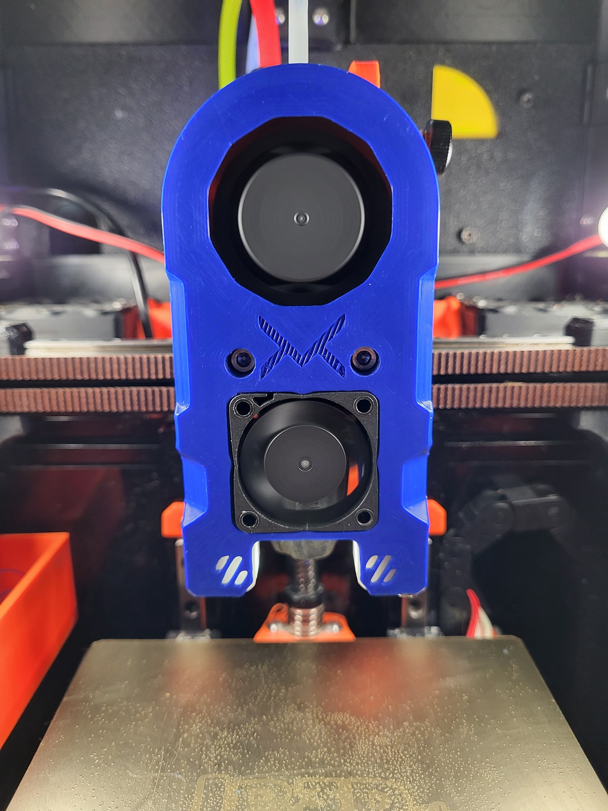](https://youtu.be/6vcyqFZt47E)

### Front:

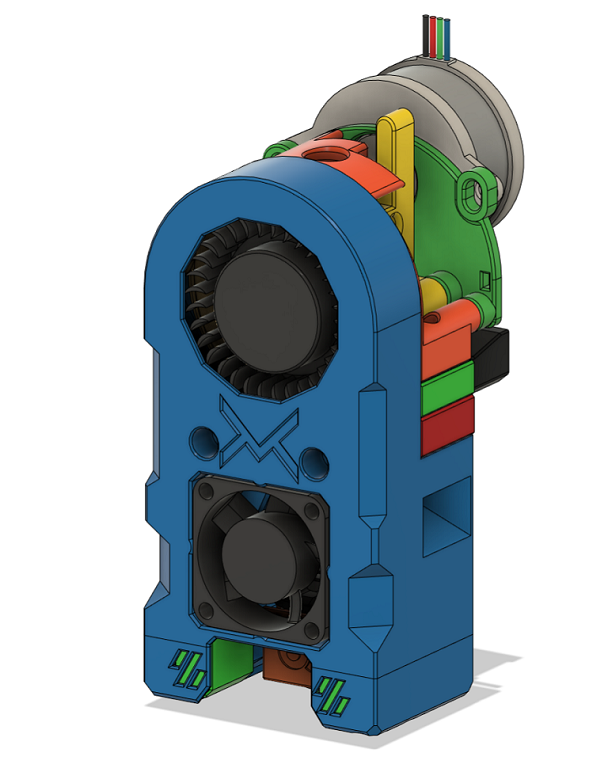

### Back:


### Computation Fluid Dynamics results:

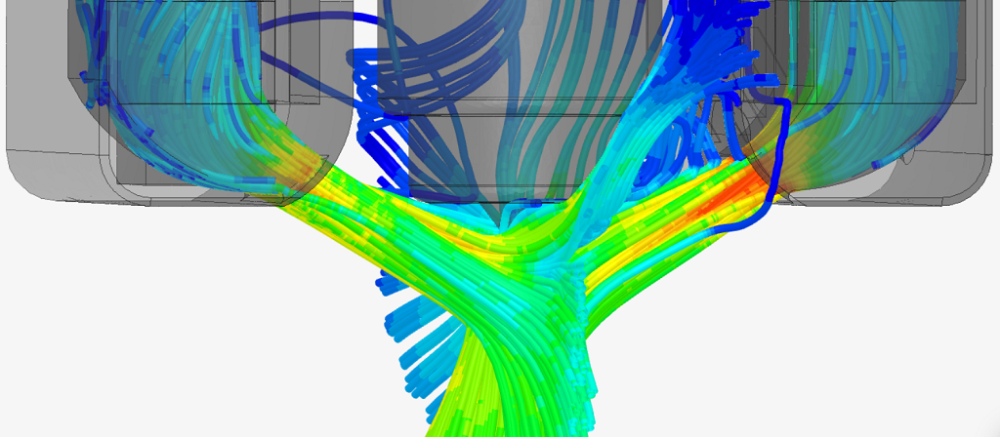

## Printing:

- Use the Voron defaults and print in ABS/ASA or better
- The parts are orientated correctly in the STLs
- The cowl has different variants for choice of probe, or no probe
- Choose the mount for the specific hotend to be used
- Choose the extruder mount required
- If using the [Voron Pocket-Watch 2](https://github.com/VoronDesign/Pocket-Watch) extruder, print the source STL's from the repository, but use the [Guts_p2_x1.stl](STLs/Guts_p2_x1.stl) from this project instead. The Pocket-Watch is [inverted for this toolhead](images/PocketWatch2.jpg). (Note: The PTFE tube will likely pop out of the top of extruder when fully unloading filament as there is no room for the tube retainer)

### Printed Parts:

v0.1 - The common parts are listed in /STLs and the v0.1 specific parts are in /STLs/v0_1

v0.2 - The common parts are listed in /STLs and the v0.2 specific parts are in /STLs/v0_2

## BOM:

- 2x M3x35mm SHCS/BHCS (2 for the X carriage mount)
- 2x M3x30mm  SHCS/BHCS (for the hotend/extruder mount)
- 1x M3x20mm SHCS/BHCS (for the v0.2 X carriage mount)
- 2(4)x Brass heat inserts (2 for cowl hotend mount, 2 optional for ADXL mount)
- 1x 5015 part cooling fan that you are happy to cut to pieces
- 1x 3010 hotend fan (24v recommended)
- 2x Neopixels and wiring (optional)

## Supported Probes:

- No probe 

- [SlideSwipe magnetic probe](https://github.com/chestwood96/SlideSwipe) 

- [ZeroClick probe](https://github.com/zruncho3d/ZeroClick)

- [(Un)Klicky Probe](https://github.com/jlas1/Klicky-Probe)

- MiniSlideSwipe using the SlideSwipe mechanism

## Supported Hotends:

- Revo Voron
- Dragon SF/HF
- DragonFly
- Rapido HF / Mellow Crazy Dragon / Dragon UHF (without extender)
- Mellow NF Crazy (/Mozzie)

### Supported Extruders:

- LGX Lite extruder

- Orbiter v1.5 (This has not been tested and might be a tight fit)

- [Voron PocketWatch 2](https://github.com/VoronDesign/Pocket-Watch)

- [RoundHouse](https://github.com/waytotheweb/voron/tree/main/general/RoundHouse) - developed for this toolhead

- [RoundAbout](https://github.com/waytotheweb/voron/tree/main/general/RoundAbout) - developed for this toolhead

## Fans:

I am using these fans:

- 24v Axial 3010: [Gdstime](https://www.aliexpress.com/item/1005002857100082.html)

## Heatsink Thermistor:

Each hotend mount includes a hole at the top to insert a thermistor where geometry allows. With this in place, klipper can track the temperature of the heatsink to watch for heat creep from the heatbreak. You can have klipper abort and shutdown before your whole toolhead melts! You only need a simple klipper entry for the appropriate pin on your MCU, e.g.:

```
[temperature_sensor Heatsink]
sensor_type: Generic 3950
sensor_pin: expander:PA5
max_temp: 85
```

Klipper will shutdown if the top of the heatsink hits 85C. You can use thermal paste to help keep a bulb thermistor in contact with the heatsink and route the wires through the provided groove, then fit the extruder on top to hold it in place.

## Assembly:

Place brass inserts into the cowl for mounting the hotend and the adxl mount if using this.

To apply the hotend/extruder mount inserts, turn the cowl upside-down and place an insert into the hole. Make sure the insert is correctly positioned and apply your soldering iron to the top of the insert and slowly apply pressure to sink it into the hole. Be careful not to push the insert in at an angle. Try to not touch the cowl with the soldering iron. If it is not entirely straight, try turning a screw into the insert from the opposite side and apply heat to the insert and straighten it using the attached screw:

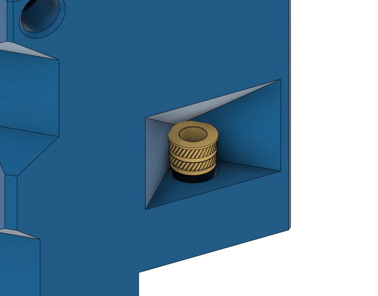

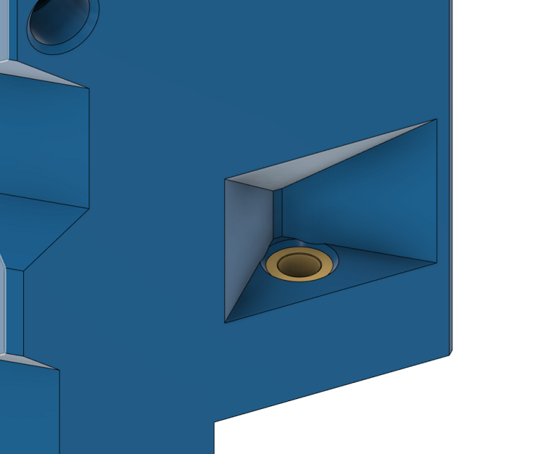

ADXL mount inserts:

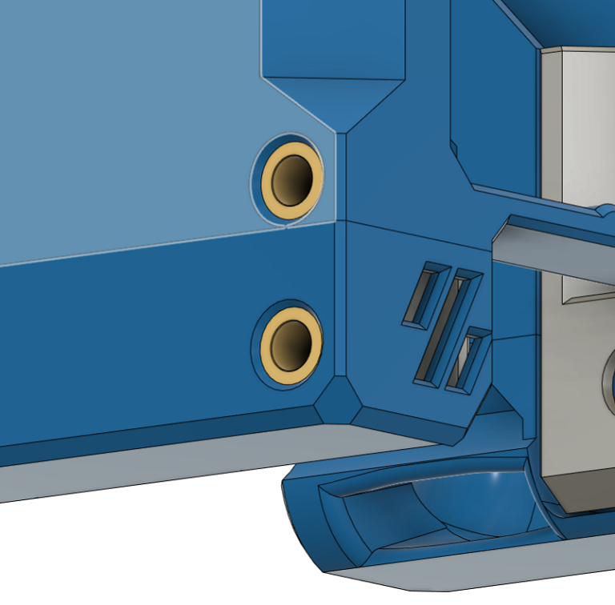

The 3010 hotend fan is meant to be press fit. If it's too tight, sand or file the opening but don't force it in otherwise it can deform and the blades will hit the casing. If it's too lose or rattles, use M3 screws to secure it through the top two holes into the cowl. Routing of the fans cables are through the channel provided:

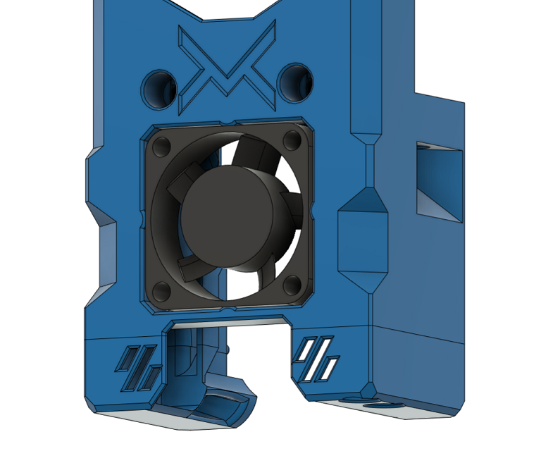


To fit the 5015 fan you need to remove most of the outer shell. Before doing so, please connect the fan to your MCU/toolhead board and ensure that it responds to pmw from klipper.

You need to split the 5015 fan casing in half by poking the tabs on the fan. Once done, take the half with the fan attached and carefully trim off the casing up to the fins. I use side cutters, but a craft knife should work. If more breaks off it shouldn't be a problem. What you want to be left with is a ~35mm circle of casing that matches the diameter of the actual fan. Be very careful not to cut the fan wires, or to manipulate the wires too much as they can easily break from their solder patches (a dab of hot glue helps):

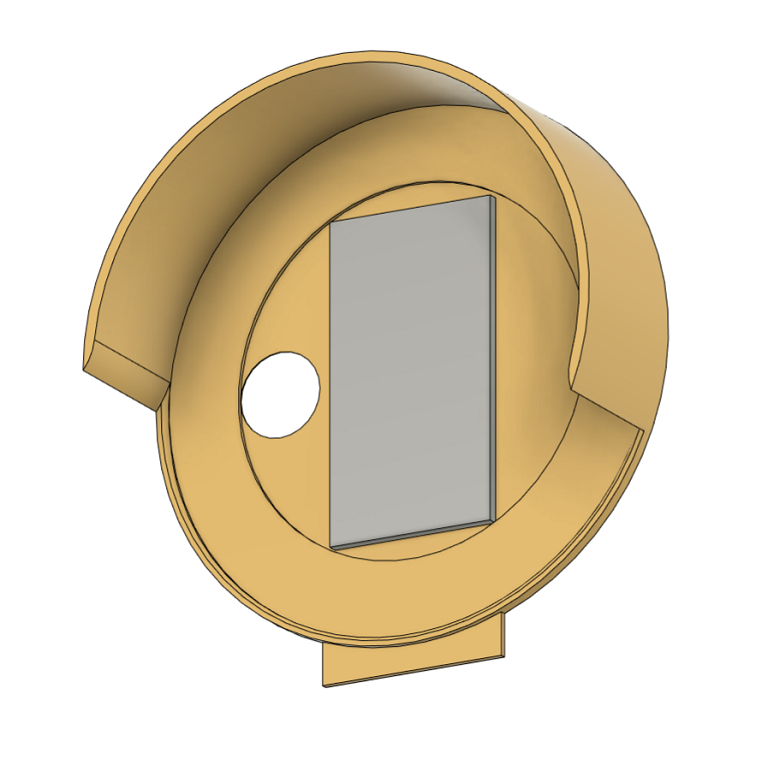

Using VHB tape, cut to fit the back of the fan. You might want to remove any stickers on the back of the fan casing to ensure a good bond.

**NOTE**: Do not cover the motor shaft/bearing on the bottom of the fan with VHB tape. Either cut a small disk of paper and cover the shaft/bearing before applying the tape, or place tape either side so that it doesn't touch the shaft/bearing.

Affix the fan to the fan cap by threading the wires through the hole and centre the fan into the middle of the fan cap. It does not need to be 100% central, but the closer the better it will look:

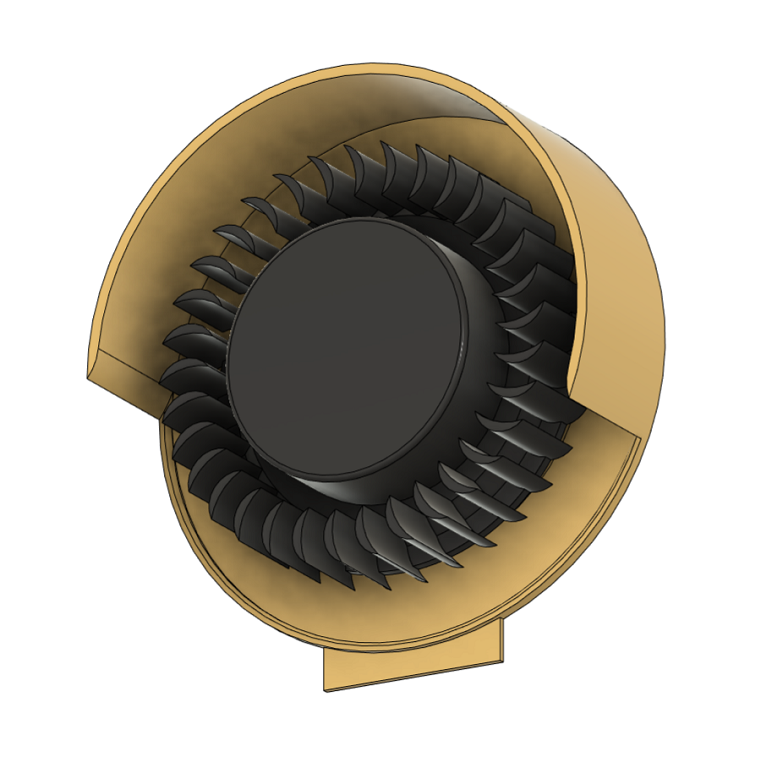

If you are going to use Neopixels, remove the two tabs at the inner base of the cowl to expose the Neopixel holes:

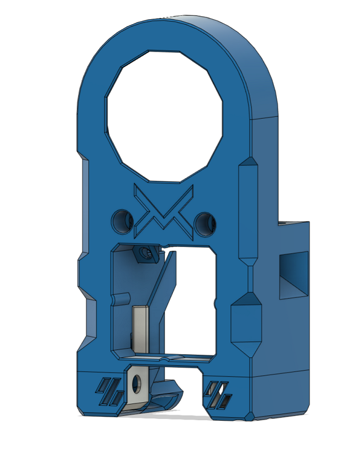

Route the Neopixel cable through the provided groove and align with the hole:

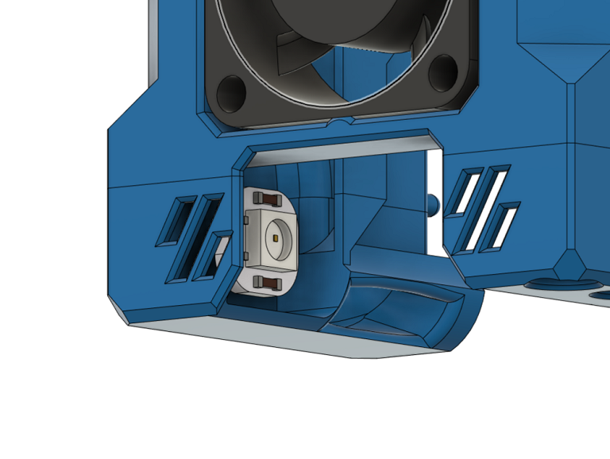

Place the Neopixel diffuser/holder over the top of the Neopixel with the longer sides facing down and the front:


Push the diffuser/holder into the whole being careful not to dislodge the Neopixel being careful not to leave the cables pinched.

Affix the extruder mount to the bottom of the extruder:

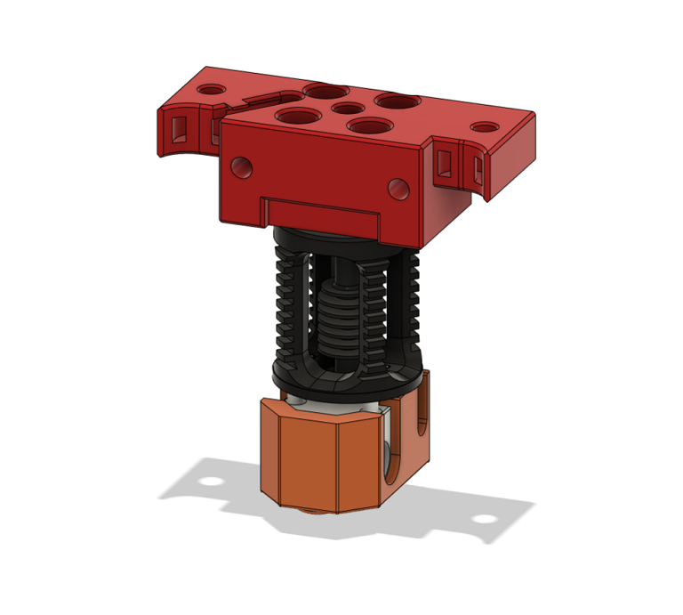

Fit the fan cap onto the cowl and ensure that it sits well without rubbing on the cowl.

Fit your chosen hotend mount to your hotend.

The fan cover is a light friction fit and is held in place by the hotend/extruder mount:


You can now route your cables and secure them to the cable-tie mounts provided:


To fit the toolhead to the printer, offer up the cowl and extruder assembly to the X carriage and secure using 2 M3x35mm screws. Be careful not to catch any wires between the surfaces. Also check that the toolhead can move completely to the left/right, front/back.

Zip-tie the wires at the back of the assembly.

Plugin, test the fans and redo your Z offset as it will have changed.

## Neopixels:

Make sure the cables interconnecting the two Neopixels is long enough to loop up both sides of the cowl and above the extruder mount at the rear:
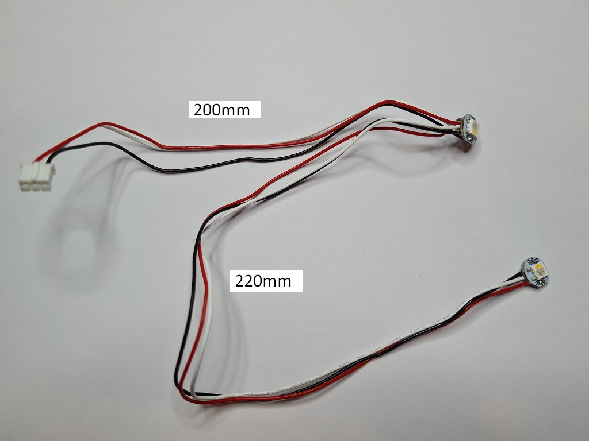

For creating the actual wiring, refer to page 46 of the [StealthBurner manual](https://github.com/VoronDesign/Voron-Stealthburner/blob/main/Manual/Assembly_Manual_SB.pdf)

To configure the Neopixels in Klipper, I'd suggest using the [StealthBurner config file](https://github.com/VoronDesign/Voron-Stealthburner/blob/main/Firmware/stealthburner_leds.cfg) and change the following to assign the two Neopixels a wider range of colour options:

```
variable_logo_idx:              "1,2"
variable_nozzle_idx:            "3" # not used
```

## MiniSlideSwipe

This uses the standard [SlideSwipe magnetic probe](https://github.com/chestwood96/SlideSwipe) mechanism, but with a different probe.

There are 2 variants:

- Microswitch

This uses a BOM microswitch. Print [MiniSlideSwipe_Shuttle_Klicky.stl](STLs/MiniSlideSwipe_Shuttle_Klicky.stl). Solder a short piece of stripped wire on the two end posts on the microswitch. Pass the bare wires up into the magnet recesses and push in the microswitch. Push (optionally glue) two magnets with the same polarity into the shuttle.

- Unklicky

This uses a magnet and 2 M3x6mm SHCS/BHCS screws. Print [MiniSlideSwipe_Shuttle_Unklicky.stl](STLs/MiniSlideSwipe_Shuttle_Unklicky.stl) and [MiniSlideSwipe_Probe_Unklicky.stl](STLs/MiniSlideSwipe_Probe_Unklicky.stl). Push one magnet into the probe. Push the probe into the shuttle and partly screw in the M3x6mm SHCS/BHCS screws to the sides of the shuttle. Using 2 pieces of stripped wire, wrap one end around the screw and place the other into the corresponding magnet hole and then tighten up the screw. Repeat for the other side of the shuttle. Push (optionally glue) two magnets with the same polarity into the shuttle. The polarity of those 2 magnets must be the reverse of the probe magnet so that the probe should now move up and down as you press it.

- For both:

Use a multimeter and check for continuity. It should show continuity when the probe is not triggered and no continuity when the switch is pressed.

On the cowl, use two wires from inside the right LED mounting hole. Use coiled bare wire from the two pieces and thread the wire into the LED mounting hole and then push (optionally glue) the magnets into the base, ensuring that they have the correct polarity so that the shuttle probe will attach to them. Run the wires up the LED channel on the inside of the hotend cowl and attach as you would for a normal [SlideSwipe magnetic probe](https://github.com/chestwood96/SlideSwipe).

Once again, use a multimeter and check for continuity. It should show continuity when the probe is attached to the hotend cowl but not triggered and no continuity when the switch is pressed.

## v1 Changelog:

- 2022-06-03 WIP release
- 2022-06-04 Added support for the Voron PocketWatch 2 extruder
- 2022-06-05 Added cable exit hole in Klicky cowl
- 2022-06-05 Added cable ducts to all cowls
- 2022-06-05 Moved zip-ties from cowls to hotend mounts
- 2022-06-07 Added Neopixel support
- 2022-06-08 Updated all STLs, images and docs
- 2022-06-11 Updated the assembly instructions
- 2022-06-13 Fixed the Revo Voron mount
- 2022-06-13 Added Rapido HF mount with no loss in Z
- 2022-07-03 Added ZeroClick support

## New version 2:

- Moved to Fusion 360
- Increased and improved airflow
- Improved heat warping protection around RGBW ducts
- Improved cable routing
- Improved RapidoHF support
- Improved hotend fan push fit
- Improved RGBW logo lighting
- Improved RGBW installation and wiring instructions
- 2 screw X carriage support (3rd screw was unnecessary)

## v2 Changelog:

- 2022-07-30 Version 2 release
- 2022-07-30 RoundHouse extruder release

## New version 3:

- Improved easy mounting using front screws
- Improved size with an reclaimed 1mm on the Y axis (it all counts!)
- Improved cable routing
- Improved RapidoHF support
- Improved fan cover
- Improved airflow using CFD for the part cooling ducts
- Improved RGBW install and routing
- New MiniSlideSwipe probe (for use with SlideSwipe)
- Improved ZeroClick support
- Improved heatbreak temperature sensor routing
- Improved built-in supports

## v3 Changelog:

- 2022-08-15 Version 3 release

## New version 4:

- Improved LED cable routing
- Modified part cooling ducts provide more space for wide hotends and long
  heater cartridges, e.g. Dragonfly
- Improved LED covers and fitting
- Improved LED housing geometry to improve print quality
- New Mellow NF Crazy (/Mozzy) hotend mount

## v4 Changelog:

- 2022-09-16 Version 4 release
- 2022-09-22 Released bowden mount with strain relief and PCB mount
- 2022-09-25 Updated Dragon Mount. Increased depth to better cater for X carriage screws
- 2022-10-05 Added MiniSlideSwipe documentation
- 2022-11-15 Modified the Dragonfly hotend mount to cater for shorter mounting screws
- 2022-11-19 Fixed the CAD STEP file
- 2022-11-23 New ADXL Mount to fit 15mm between screws
- 2022-12-22 Added improved ADXL mount and a [KUSBA]([GitHub - xbst/KUSBA: Klipper USB Accelerometer Project](https://github.com/xbst/KUSBA)) Mount

## New version 5:

- Improved part cooling fan housing geometry

- Improved fan cover retention (this fan cover is not compatible with previous toolhead version, so if moving to the v5 toolhead you will need to print this new fan cover and move the fan from the old to the new cover by carefully prising it from the VHB tape - it can be done, I do it often!)

- Improved airflow through part cooling ducts

- Increased the size of the part cooling duct exits

- Added bridge cutter holes to front cowl mount points

- Removed printed supports for the fan ducts as they are no longer needed with the current geometry

- Fixed alignment issue with heat insert holes for the hotend/extruder mounts

- Updated design

- Added v0.2 compatibility

## v5 Changelog:

- 2023-01-17 Version 5 release
- 2023-01-31 Geometry fixes to the cowls to help with first layer print and some thin walls
- 2023-02-03 Geometry fixes to cowls
- 2023-02-03 Added sliders to the cowls and hotend mounts to help prevent the toolhead from tilting
