# Rainbow Dragon Extruder (WIP/BETA)

This toolhead is a dual filament extruder for the Voron v0.2 and various [Printers for Ants](https://3dprintersforants.com/). It has been specifically designed for the Phaetus TaiChi dual filament hotend and is exclusively developed for use with the [Dragon Burner](https://github.com/chirpy2605/voron/tree/main/V0/Dragon_Burner) v7+ toolhead.

There are also [Mounts](https://github.com/chirpy2605/voron/tree/main/general/Large_Voron_Mounts) available to use this toolhead to the Voron Trident, v2.4, Switchwire and Legacy printers.

There should be no loss in X, Y or Z.


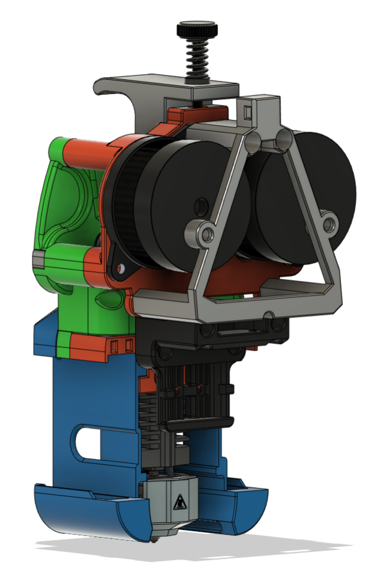


## Warnings:

This is not a plug and play solution. The extruder is a work in progress, as are the klipper code and slicer settings.

I would not recommend embarking on this project unless you are up for a challenge and understand klipper configuration and slicer configuration and tweaking.

The config and settings provided are what has worked for me so far. It's possible they may not work for you and you will need to resolve such issues yourself. An example might be your `PRINT_START` configuration may need adjusting.

## Notes:

- On the Voron V0, this only works with the Dragon Burner v7+ toolhead

- Print speed. MM prints are not fast. Each layer requires another print onto the wipe tower. Filament layer swaps take longer on the wipe tower. The TaiChi is not a high flow hotend. Acceleration is your friend, especially on the v0. There appears to be no way to speed up wipe tower printing, so it takes as long as it takes

- CAD will be made available when it comes out of BETA

## Printing:

Use the Voron defaults and print in ABS or better. The parts are orientated correctly in the STLs.

## BOM:

- 1 x TaiChi hotend
- 1 x Spare stepper driver slot on the printer MCU (you should have one if you use CANbus, otherwise you will need a new MCU)
- 2 x Nema 14 pancake stepper motors
- 2 x BMG gear sets
- 2 x ECAS04 connectors
- 14 x Brass heat inserts
- 2 x 25mm 4mm OD 2mm ID PTFE tube
- A bunch of M3 BHCS screws

## Assembly:

Remove the supports from the Front part:

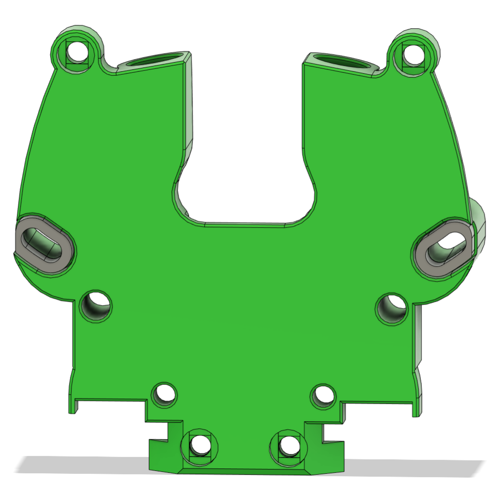

Add heat inserts into the Front, Back and PCB Mount parts:


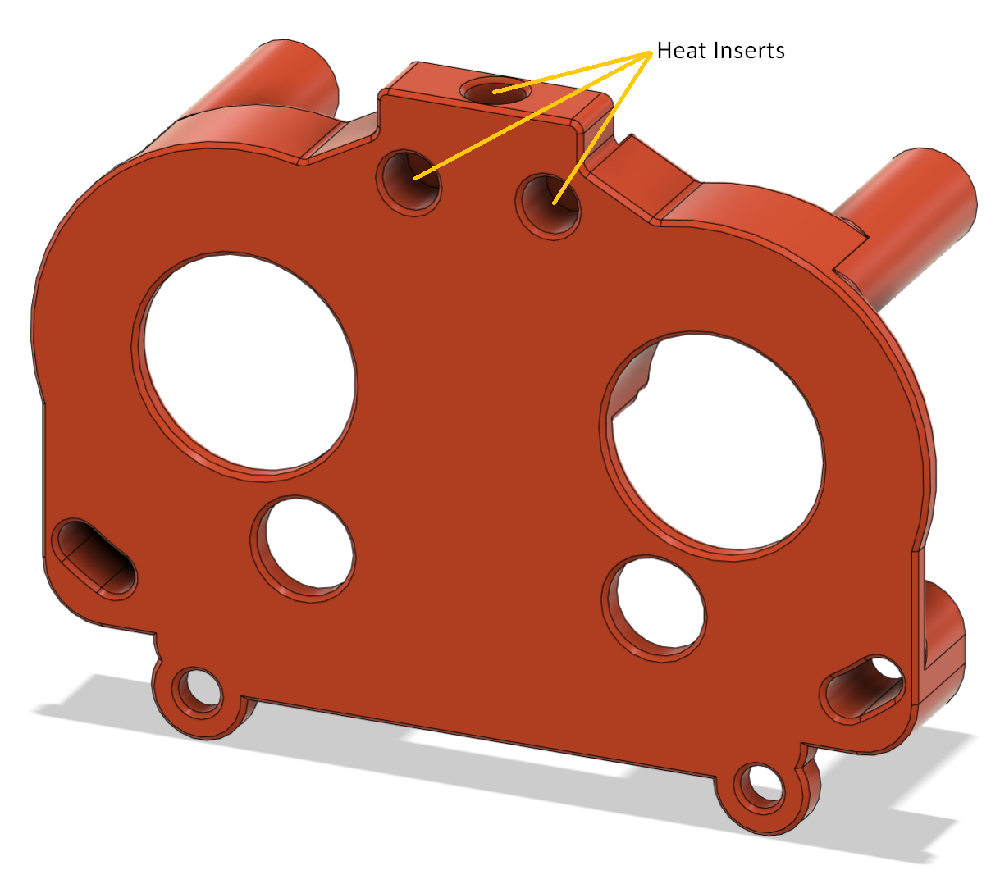


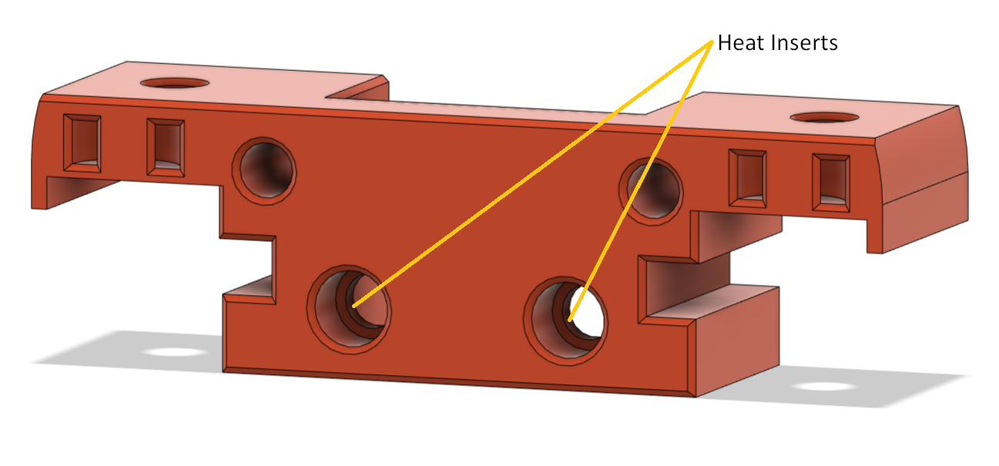

Push the 4 bearings into the Front and Rear parts:


Push the ECAS fittings into the Front part:


Push the two PTFE tubes into each side of the TaiChi hotend. Then push the PTFE tubes with the hotend into the holes in the Front part. You may need to trim the PTFE tube a little to get a snug fit:


Screw in the Taichi mount part to the Front part. Be careful to use M3 SHCS screws that do not protrude beyond the heat inserts, otherwise you will have problems mounting the extruder to the cowl:


Insert the large gears with the hobbed gear attached and secured by the grub screw on the flat part of the shaft into the bearings in the Front part:


Fit the Back part onto the large gear shaft through the rear bearings, be careful not to pus the bearings out of the Back part:

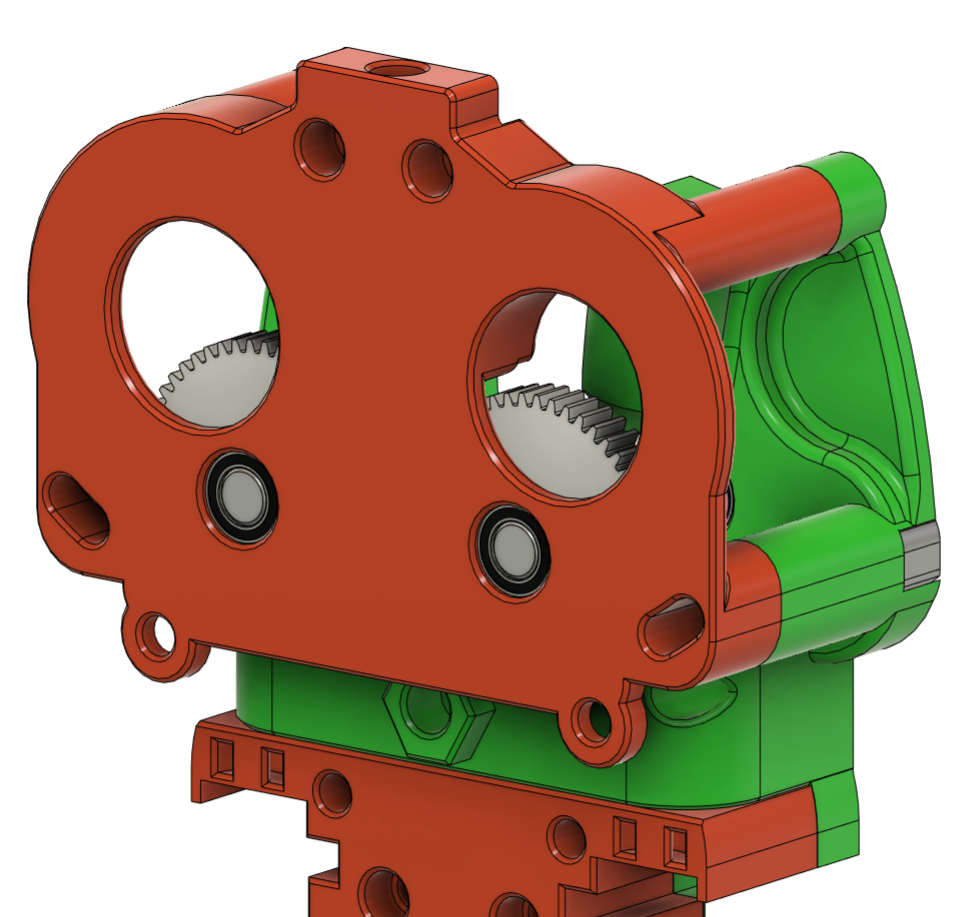

Secure the Front and Back parts using 2 screws inserted from the Front part.

For each Nema14 motor, place on the Back part and loosely screw from the front to the bottom screw of the motor. Then place the PCB Mount over the stepper motors and screw in the top two screws:


Next, holding a short screw with a pair of pliers, screw the bottom part of the PCB mount to the Back part with a hex key inserted through the Front part:

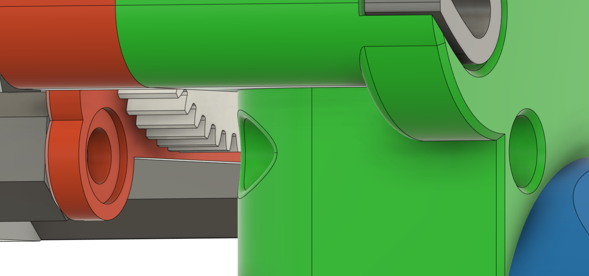

Insert the gears on shafts into the Latch:

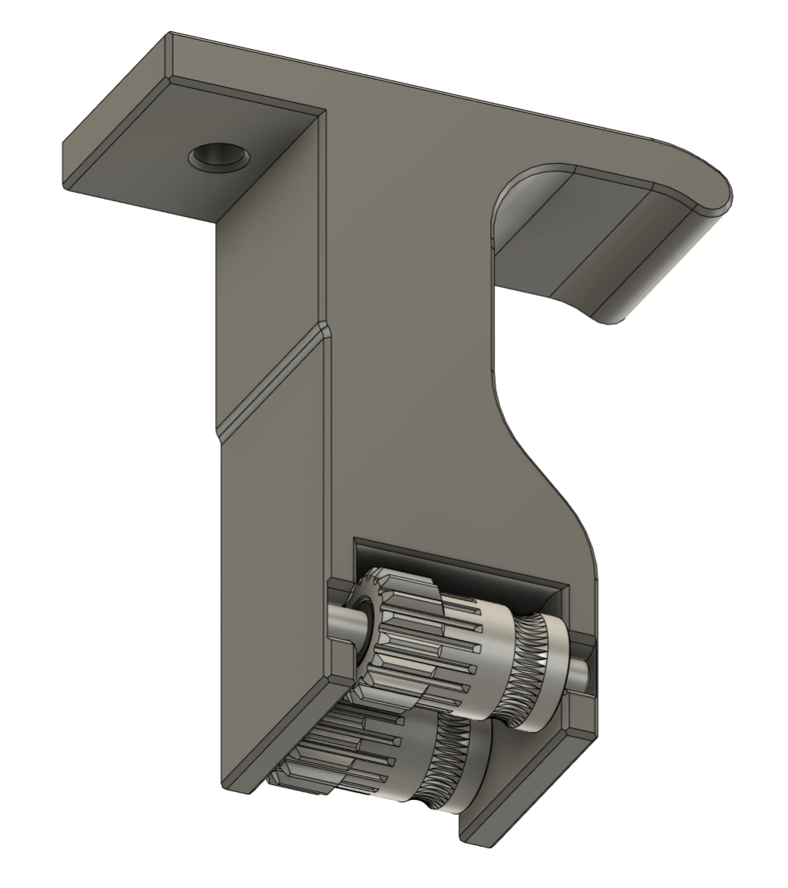

Now install the Latch by pushing the bottom with gears through the tight gap in the front:

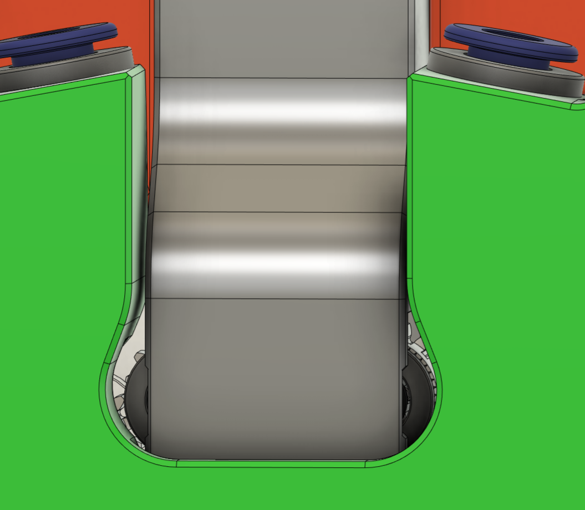

Secure the thumbscrew, spring and washer through the Latch and into the Back part:

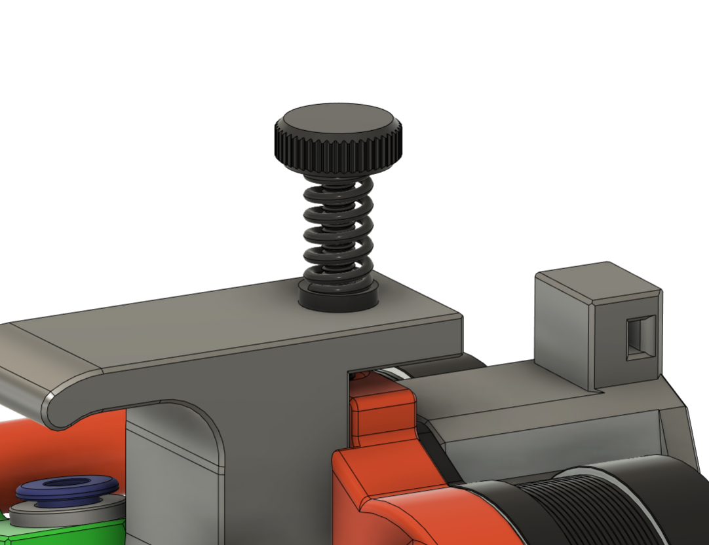

You should adjust the location of the hobbed gears such that they are aligned with the filament path. You can do this by exposing the grubs crew on each side and moving the gear back and forth until in the optimal position is found, then secure with the grub screw. The gears in the Latch should self align when filament is passed through.

Finally, adjust the stepper motors so that the drive gear engages with the Large gear and adjust the backlash so that the contact is not too tight, then tighten the mounting screws from the front.

The toolhead can then be mounted onto the Dragon Burner and installed in the printer.

If you are using CANbus you should have a spare extruder stepper port on your existing MCU, otherwise you will need an MCU that can support 5 stepper motors instead of 4. Wire the stepper motors to your setup.

## Klipper Configuration:

Upload and include the RainbowDragon.conf file. You will then need to modify several settings according to your printers configuration:

For the additional extruder motor, set:

```
step_pin:
dir_pin:
enable_pin:
```

For the extruder stepper:

```
uart_pin:
tx_pin:
run_current
```

You should then set values for the `PRESSURE_ADVANCE` settings `ADVANCE=` and `SMOOTH_TIME=` for each extruder, or set to defaults if not yet determined.

Once done, include the RainbowDragon.conf file into your main printer.cfg.

## Testing:

- Test and PID tune the hotend

- Test motion of each extruder - if using KlipperScreen you should see two extruders in the "Extrude" Menu.

- Load filament into one extruder until it extrudes through the hotend. Retract the filament 50mm

- Load filament into the other extruder until it extrudes through the hotend

Adjust the thumbscrew as necessary during filament loading.

## Slicer Configuration:

The following steps are for SuperSlicer as it's the one I use:

In Printer Settings:

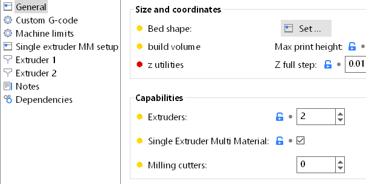

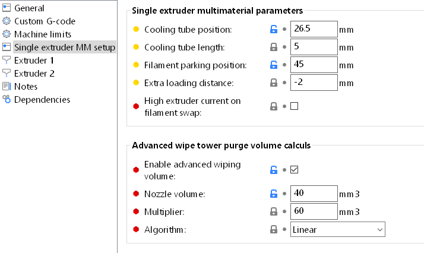


In Filament Settings:

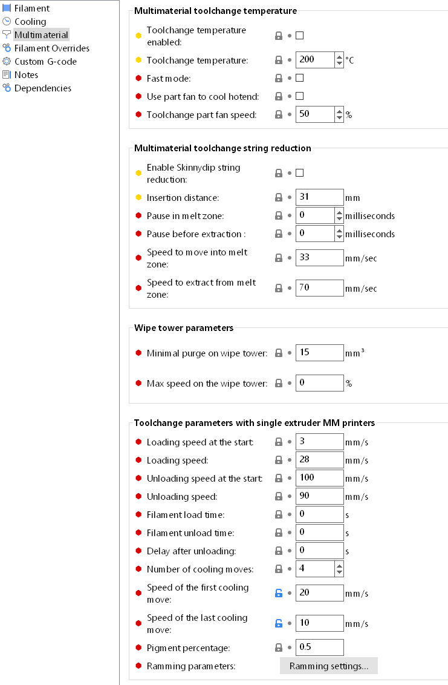

In Print Settings:

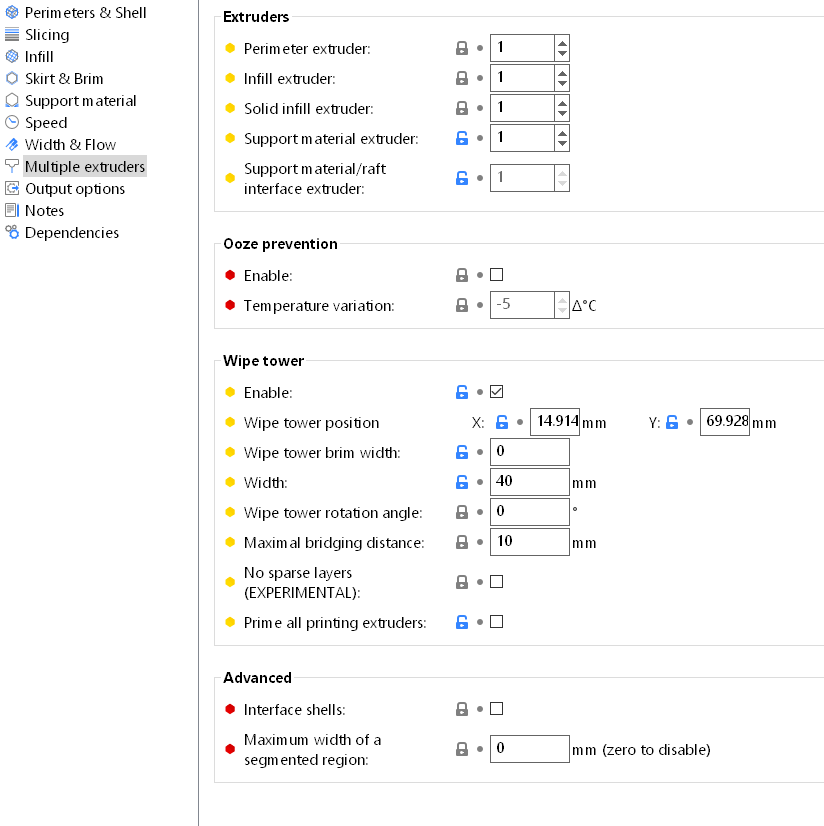

These settings may need to be tweaked. In particular the "Advance wipe tower purge" settings depending on how much filament mixing you can tolerate.

The hotend seems to max out at ~13mm3/s but I have not tested this to any extent.

Good Luck!

## Contact:

You can find my on Discord under @chirpy__

## Changelog:

2023-08-19 Initial Release
