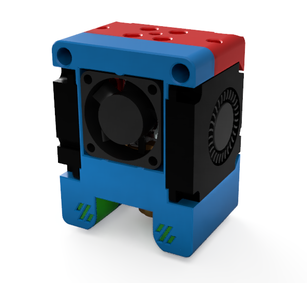
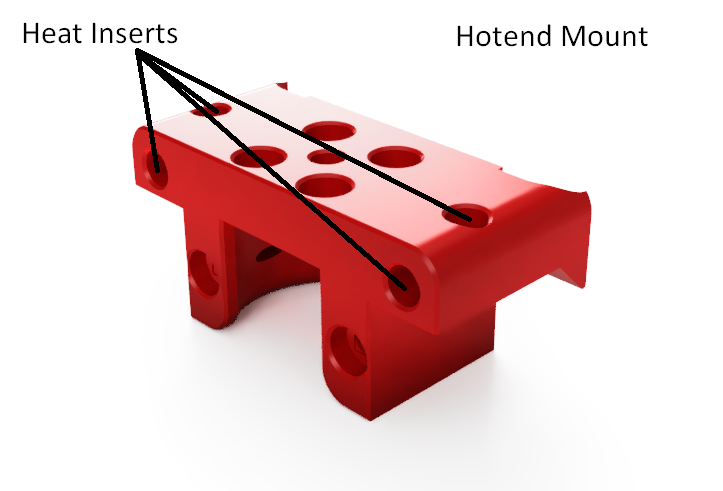
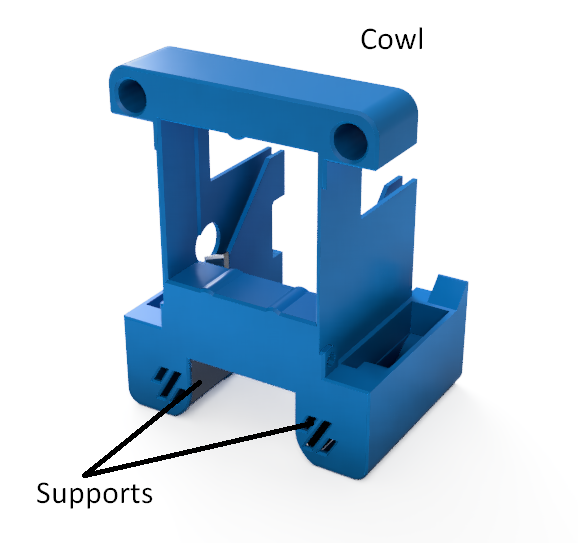
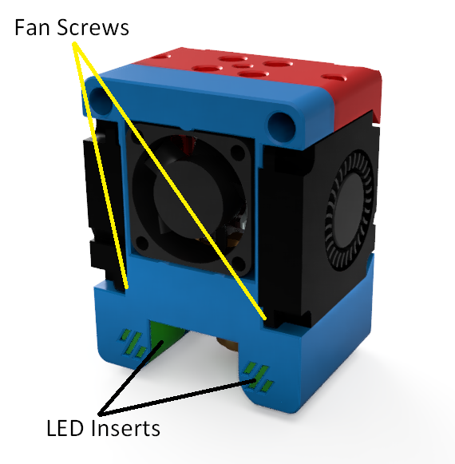
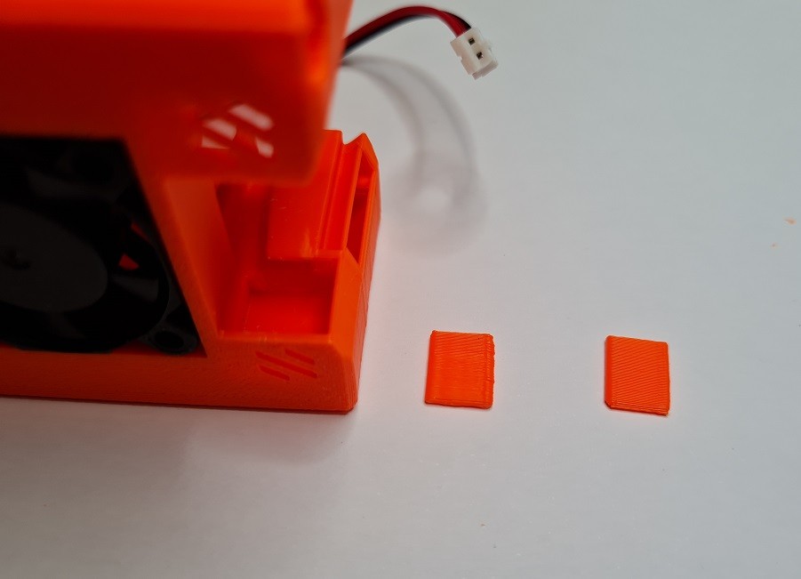
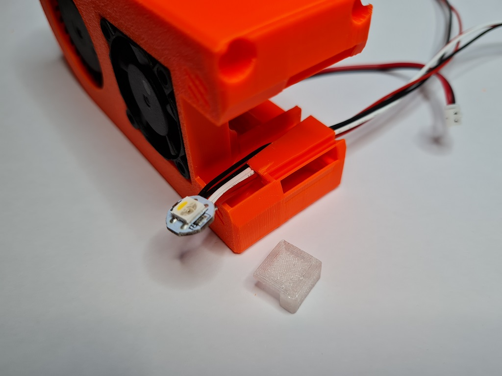
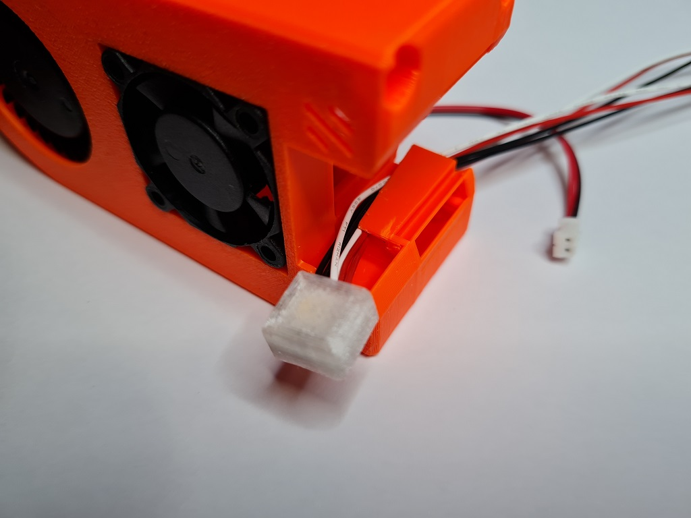
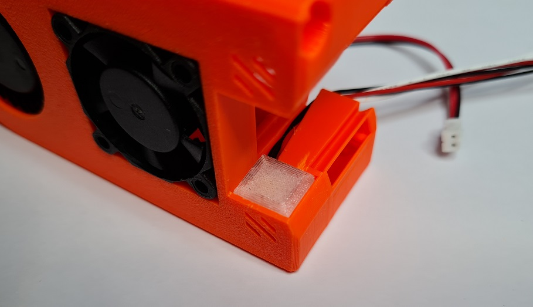
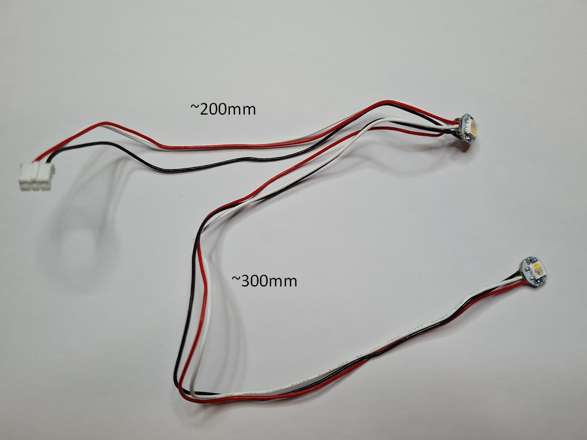

# Rapid Burner v2

This toolhead for the Voron v0.1 has been specifically designed for the Rapido UHF and Dragon UHF hotends.

It uses the standard Voron X carriage. There's no loss in X or Z, and at most 3mm in Y.




## Features:

### Hotend support:

- Rapido UHF hotend
- Dragon UHF hotend

### Extruder support:

- LGX Lite extruder support
- Mini Sherpa extruder support
- Sailfin/Sharkfin extruder support
- Orbiter v1.5 extruder support
- Orbiter v2 extruder support
- [RoundHouse extruder](https://github.com/waytotheweb/voron/tree/main/general/RoundHouse) support

### Fan support:

- Single 3010 24v hotend cooling fan
- Twin 4010 24v blower part cooling fans
- Screwless hotend fan attachment

### Probe support:

- MiniSlideSwipe (uses the [SlideSwipe magnetic probe](https://github.com/chestwood96/SlideSwipe))
- [SlideSwipe magnetic probe](https://github.com/chestwood96/SlideSwipe) support
- [(Un)Klicky Probe](https://github.com/jlas1/Klicky-Probe) support
- [ZeroClick probe](https://github.com/zruncho3d/ZeroClick) support

## Printing:

- Use the Voron defaults and print in ABS or better. The parts are orientated correctly in the STL.
- Print the appropriate cowl for your sensor probe if you use one
- Print the appropriate hotend mount
- Print the extruder mount if needed

## BOM:

- 2x M3x20mm SHCS/BHCS (2 for the X carriage mount)
- 6x M3x5x4mm heat inserts (4 for extruder mount, optional: 2 for ADXL mount)
- 6x M3x8mm SHCS/BHCS (4 for extruder mount, optional: 2 for ADXL mount)
- 2x M2x10mm self tapping screws (for blower fans)
- 2x M2x8mm BHCS and nuts (optional: to mount ADXL)
- 2x 4010 blower fans (24v recommended)
- 1x 3010 hotend fan (24v recommended)

The cowls support a no probe setup, [SlideSwipe magnetic probe](https://github.com/chestwood96/SlideSwipe), [(Un)Klicky Probe](https://github.com/jlas1/Klicky-Probe) and [ZeroClick probe](https://github.com/zruncho3d/ZeroClick)

## Fans:

I am using these fans:

- 24v Axial 3010: [Gdstime](https://www.aliexpress.com/item/1005002857100082.html)
- 24v Blower 4010: [Gdstime](https://www.aliexpress.com/item/32799324058.html)

## Assembly:

Add heat inserts into the cowl and hotend mount:



Remove the supports from the LED recesses if you are going to use them:



Fitting the fans: You will need to release the cable from their tabs on the 3010 frontend fan and one of the 4010 fans. This is to allow the cables to be routed correctly through the cowl. Care should be taken with the cables after doing this as too much movement could break off the wires from the fans. It helps if you can add a blob of hot glue as strain relief.

Fit the 4010 fan that you released the cable from into the cowl, passing the cable through the provided round hole:


The 3010 hotend fan is press fit. Feed the cable through the front of the cowl and then push the fan into the cowl from the front. If it's too tight, sand or file the opening. Don't force it in, otherwise it can deform and the blades will hit the casing. Routing of the fans cables are through the channel provided:



Now slot in the second 4010 fan and use 2x M2x10mm self tapping screws to secure the fans into the cowl.

If you are going to use LED Neopixels, remove the two tabs at the inner base of the cowl to expose the Neopixel holes (images taken from the [MailBox toolhead](https://github.com/waytotheweb/voron/tree/main/V0/5015_Toolhead)):



Route the Neopixel cable through the provided groove and align with the hole:



Place the Neopixel diffuser/holder over the top of the Neopixel with the longer sides facing down and the front:



Push the diffuser/holder into the whole being careful not to dislodge the Neopixel being careful not to leave the cables pinched:



Route the cables through the provided channels in the cowl.

## Mounting:

Mount the extruder to the hotend mount. If using an LGX Lite you will need to use the LGX Lite Mount.

The hotend mount now needs to be mounted to the X Carriage using 2x M3x20mm screws.

Offer the cowl to the hotend mount and from the front use 2 M3x8mm screws to secure the cowl and the hotend mount together.

Be careful not to catch any wires between the surfaces and that when the toolhead moves the X and Y axis endstops are triggered. Also check that the X axis can move completely to the left and right.

Zip-tie the wires at the back of the assembly.

Plugin, test the fans and redo your X offset as it will have changed.

## Neopixels:

Make sure the cables interconnecting the two Neopixels is long enough to loop up both sides of the cowl and above the extruder mount at the rear:


For creating the actual wiring, refer to page 46 of the [StealthBurner manual](https://github.com/VoronDesign/Voron-Stealthburner/blob/main/Manual/Assembly_Manual_SB.pdf)

To configure the Neopixels in Klipper, I'd suggest using the [StealthBurner config file](https://github.com/VoronDesign/Voron-Stealthburner/blob/main/Firmware/stealthburner_leds.cfg) and change the following to assign the two Neopixels a wider range of colour options:

```
variable_logo_idx:              "1,2"
variable_nozzle_idx:            "3" # not used
```

## MiniSlideSwipe:

This uses the standard [SlideSwipe magnetic probe](https://github.com/chestwood96/SlideSwipe) mechanism, but with a different probe.

There are 2 variants:

- Microswitch

This uses a BOM microswitch. Print [MiniSlideSwipe_Shuttle_Klicky.stl](STLs/MiniSlideSwipe_Shuttle_Klicky.stl). Solder a short piece of stripped wire on the two end posts on the microswitch. Pass the bare wires up into the magnet recesses and push in the microswitch. Push (optionally glue) two magnets with the same polarity into the shuttle.

- Unklicky

This uses a magnet and 2 M3x6mm SHCS/BHCS screws. Print [MiniSlideSwipe_Shuttle_Unklicky.stl](STLs/MiniSlideSwipe_Shuttle_Unklicky.stl) and [MiniSlideSwipe_Probe_Unklicky.stl](STLs/MiniSlideSwipe_Probe_Unklicky.stl). Push one magnet into the probe. Push the probe into the shuttle and partly screw in the M3x6mm SHCS/BHCS screws to the sides of the shuttle. Using 2 pieces of stripped wire, wrap one end around the screw and place the other into the corresponding magnet hole and then tighten up the screw. Repeat for the other side of the shuttle. Push (optionally glue) two magnets with the same polarity into the shuttle. The polarity of those 2 magnets must be the reverse of the probe magnet so that the probe should now move up and down as you press it.

- For both:

Use a multimeter and check for continuity. It should show continuity when the probe is not triggered and no continuity when the switch is pressed.

On the cowl, use two wires from inside the right LED mounting hole. Use coiled bare wire from the two pieces and thread the wire into the LED mounting hole and then push (optionally glue) the magnets into the base, ensuring that they have the correct polarity so that the shuttle probe will attach to them. Run the wires up the LED channel on the inside of the hotend cowl and attach as you would for a normal [SlideSwipe magnetic probe](https://github.com/chestwood96/SlideSwipe).

Once again, a multimeter and check for continuity. It should show continuity when the probe is attached to the hotend cowl but not triggered and no continuity when the switch is pressed.

## v1 Changelog:

- 2022-09-04 First beta release
- 2022-09-21 Fixed ZeroClick cowl
- 2022-09-22 Released bowden mount

## v2 Changelog:

- 2022-11-02 Version 2 release
- 2022-11-29 Hotend Mount geometry fixes
- 2022-11-29 Updated ZeroClick Cowl and Mount
