# Rapid Burner v8 (BETA Release)

**NOTE:** This is the v8 BETA release of this toolhead. There may be problems with STLs, documentation and fitment. Final release with CAD will come as soon as everything is stable

This toolhead for the Voron v0.2 and various [Printers for Ants](https://3dprintersforants.com/).

There are also [Mounts](https://github.com/chirpy2605/voron/tree/main/general/Large_Voron_Mounts) available to use this toolhead to the Voron Trident, v2.4, Switchwire and Legacy printers.

It has been specifically designed for the Rapido UHF and Dragon UHF hotends.

The Goliath Air and Goliath Water hotends are also supported.

It uses the standard Voron v0.2 X carriage and also works on both MGN7H and MGN9C rail x-carriages. There's no loss in X, Y or Z.

It supports Nozzle and Logo mounted LED's.

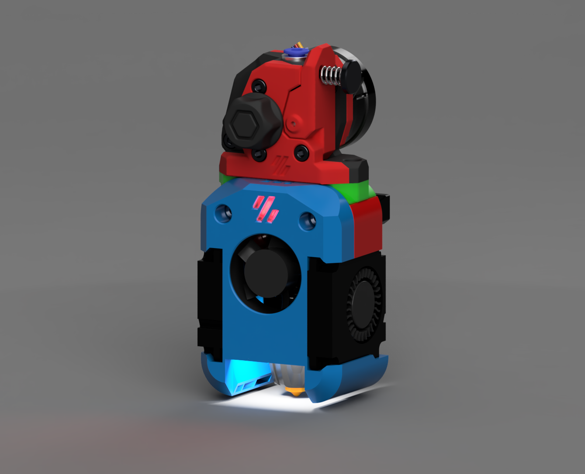

---

- [CFD Analysis](#cfd-analysis)

- [Notes](#notes)

- [Hotend support](#hotend-support)

- [Extruder support](#extruder-support)

- [Fan support](#fan-support)

- [Probe support](#probe-support)

- [Extras](#extras)

- [Printing](#printing)

- [BOM](#bom)
  
  - [Hotend specific BOM](#hotend-specific-bom)

- [Fans](#fans)

- [Heatsink Thermistor](#heatsink-thermistor)

- [Assembly](#assembly)
  
  - [Heat Inserts](#heat-inserts)
  - [LEDs](#leds)
  - [Logo LED](#logo-led)
  - [Nozzle Neopixels](#nozzle-neopixels)
  - [Nozzle Sequins & Neopixel Sequins](#nozzle-sequins-neopixel-sequins)
  - [LED Software](#led-software)
  - [Fans](#fans-1)

- [PCB Mounts](#pcb-mounts)

- [Alternative Mounts](#alternative-mounts)

<!-- **Having trouble choosing the right STL's?** Tryout the [**Online STL Configurator**](https://chirpy2605.github.io/DragonBurnerConfig/#/) created by [Maple Leaf Makers](https://github.com/MapleLeafMakers) -->

---

## CFD Analysis:

There is a [document](cfd/) showing the development of the v8 part cooling ducts, describing the CFD analysis and test prints that went into making them.

### Notes:

On the Voron V0, this version only supports the v0.2 X -carriage.

You can also continue to use the [Rapid Burner v4](https://github.com/chirpy2605/voron/tree/main/V0/Rapid_Burner/Old_Versions/v4) for the v0.1 X -carriage.

### Hotend support:

- Rapido UHF hotend
- Dragon UHF hotend
- Goliath Air
- Goliath Water
- E3D V6 Groove Mount Volcano

### Extruder support:

- LGX Lite (use the Sherpa Mini hotend mount)
- Sherpa Mini
- Sherpa Micro
- Sailfin/Sharkfin
- Orbiter v1.5
- Orbiter v2
- Vz-HextrudORT (LGX Lite mount)
- Double Folded Ascender (not for the Goliath Hotend)
- [RoundTrip](https://github.com/waytotheweb/voron/tree/main/general/RoundTrip) (Gears from the LGX Lite, TBG Lite, Orbiter v1.5, Orbiter v2)
- Galileo v2 Standalone (G2SA) with specific mounts for Sherpa Mini and Orbiter v2 mount hole configurations

### Fan support:

- Single 3010 24v hotend cooling fan
- Twin 4010 24v blower part cooling fans
- Screwless hotend fan attachment
- Screwless part cooling fan attachment

**NOTE**: If you use the HoneyBadger 4010 blower fans from Fabreeko you may want to include the following in your klipper config. This is because those fans are slightly out of spec as their vanes protrude from the fan housing and can hit the right X gantry whilst spinning:

- At the top of `[homing_override]` add:

```
    
    M106 S0
```

- And at the very end of `[homing_override]`

```
    M106 S{fan_speed_before_homing}
```

### Probe support:

- MiniSlideSwipe (uses the [SlideSwipe magnetic probe](https://github.com/chestwood96/SlideSwipe))
- [SlideSwipe magnetic probe](https://github.com/chestwood96/SlideSwipe) support
- [(Un)Klicky Probe](https://github.com/jlas1/Klicky-Probe) support
- [ZeroClick probe](https://github.com/zruncho3d/ZeroClick) support

For Klick support see following sites for implementation:

[Klicky-Probe/Printers/Voron/v0 at main · jlas1/Klicky-Probe · GitHub](https://github.com/jlas1/Klicky-Probe/tree/main/Printers/Voron/v0#integrated-cowling-v01)

[Klicky-Probe/Probes/KlickyNG at main · jlas1/Klicky-Probe · GitHub](https://github.com/jlas1/Klicky-Probe/tree/main/Probes/KlickyNG)

## Extras:

- ADXL345 front mount
- Heatsink thermistor support
- Neopixel support (nozzle and logo)
- Adafruit Sequin support
- [Lab4450]([Shop - RGB Neopixel Sequins for Voron Mini SB - Lab4450.com](https://lab4450.com/product/rgb-neopixel-sequins/)) Neopixel Sequin support

## Printing:

- Use the Voron defaults and print in ABS or better. The parts are orientated correctly in the STL.
- Print the appropriate cowl for your sensor probe if you use one
- Print the appropriate extruder hotend mount
- Print the extruder mount

## BOM:

- 2 x M3x12mm BHCS/SHCS to secure cowl to X carriage
- 2 x M3x8mm BHCS/SHCS to secure cowl to hotend mount
- 1 x M3x20mm BHCS/SHCS to secure X carriage to toolhead from the rear
- 2 x M3x6mm BHCS to secure rear brace to lower cowl
- 2 x M3x(20mm or 18mm or 14mm) BHCS to secure extruder to hotend mount. Screw length depends on extruder and hotend mount
- 1 x M3 nut preferably square over hexagonal to secure the 20mm screw through the X carriage to the rear of the toolhead
- 2 x M3x25mm BHCS/SHCS to secure ADXL mount through cowl to X carriage (optional, preference would be for a nozzle mounted ADXL)
- 2 x M3 brass heat inserts to secure cowl to hotend mount
- 2 x M3 brass heat inserts to secure extruder to hotend mount
- 2 x 4010 24v blower fans for part cooling
- 1 x 3010 24v axial fan for hotend cooling
- 3 x LEDs for logo and nozzle lights (optional, can be a mixture of NeoPixels and/or Sequins)
- 2 x 2.5mm nylon zip ties for cable management

#### Hotend specific BOM:

v6:

- 2 x M3 brass heat inserts
- 2 x M3x16mm BHCS/SHCS

The cowls support a no probe setup, [SlideSwipe magnetic probe](https://github.com/chestwood96/SlideSwipe), [(Un)Klicky Probe](https://github.com/jlas1/Klicky-Probe) and [ZeroClick probe](https://github.com/zruncho3d/ZeroClick)

## Fans:

I am using these fans:

- 24v Axial 3010: [Gdstime](https://www.aliexpress.com/item/1005002857100082.html)
- 24v Blower 4010: [Gdstime](https://www.aliexpress.com/item/32799324058.html)

## Heatsink Thermistor:

Each cowl includes a hole at the top to insert a thermistor. With this in place, klipper can track the temperature of the heatsink to watch for heat creep from the heatbreak. You can have klipper abort and shutdown before your whole toolhead melts! You only need a simple klipper entry for the appropriate pin on your MCU, e.g.:

```
[temperature_sensor Heatsink]
sensor_type: Generic 3950
sensor_pin: expander:PA5
max_temp: 85
```

Klipper will shutdown if the top of the heatsink hits 85C. You can use thermal paste to help keep a bulb thermistor in contact with the heatsink and route the wires through the provided groove, then fit the extruder on top to hold it in place.

## Assembly:


## Heat Inserts:

Add 4 heat inserts into the hotend mount. Most hotend mounts accept them from underneath, some need them from the top:


## LEDs:

Support has been added for either standard Neopixels or Sequins for the nozzle LEDs, Neopixels, Sequins and RainbowBarf for the Logo LED.

If you do not want to use the Logo LED you can fit the [a]_Carrier_Dummy.STL instead and print an opaque diffuser.

LED's are best cabled in series if they are addressable to allow independent control.

There are 2 soldering jigs included in the repo, one for Neopixels and one for Sequins. They should help with soldering the wires for the nozzle lights with the correct gap space and can be used for the Logo LED as well.

The following is one solution to wiring the LEDs. There are a myriad of others, but this works relatively easily:

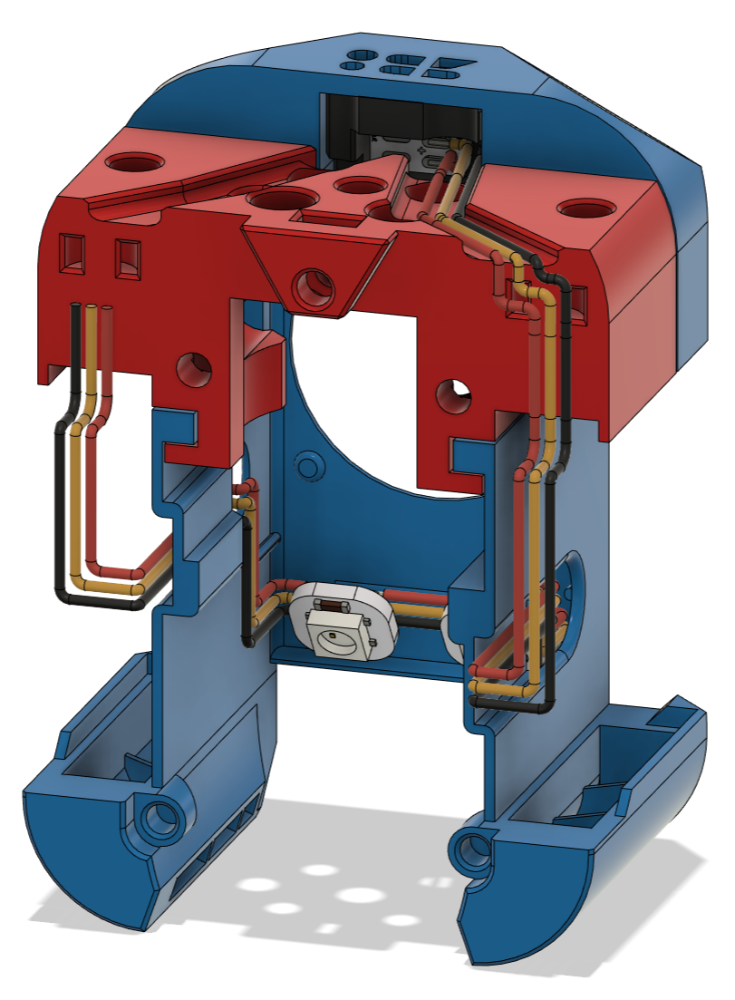

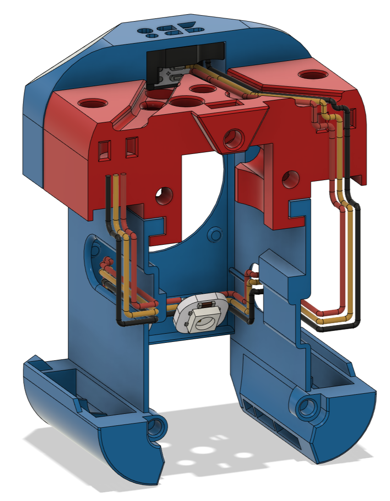

# 

### Logo LED:


You need to print the [c]*Diffuser.stl out of a transparent/translucent filament, such as natural ABS. You then will need to print the [o]_Carrier*[led type].stl of choice in an opaque filament to help prevent light bleed. The filament used to print the Cowl will likely be fine.

The LED is inserted into the side of the carrier. The diffuser sits inside the front of the carrier:

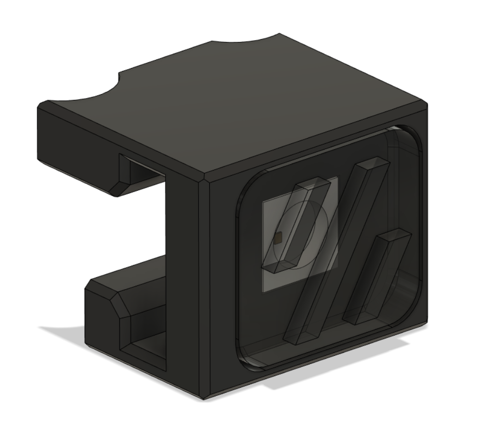

The logo unit is pushed into the cowl from the rear:

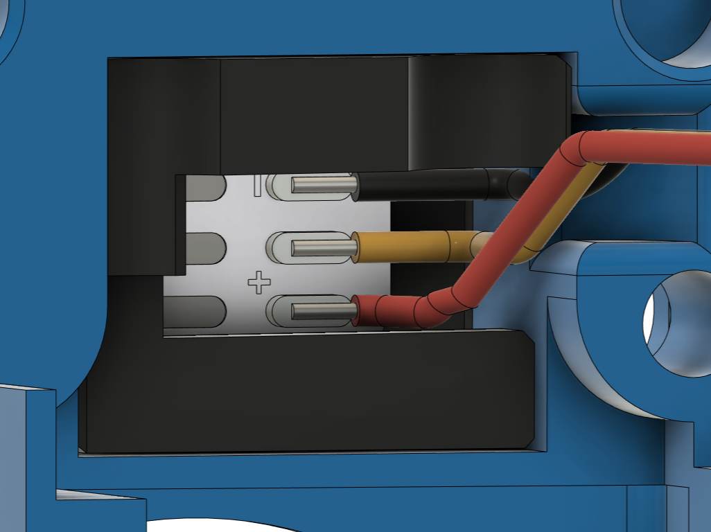

### Nozzle Neopixels:

Fit the neopixels into the neopixel carrier and then slot into the cowl being careful not to pinch any wires:

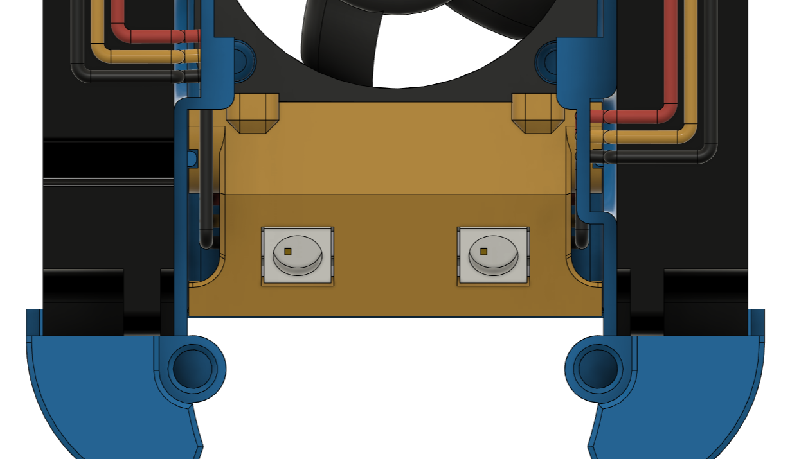

### Nozzle Sequins & Neopixel Sequins:

Fit the sequins into the sequin carrier and then slot into the cowl being careful not to pinch any wires:

### LED Software:

To configure the Neopixels in Klipper, I'd suggest using the [GitHub - julianschill/klipper-led_effect: LED effects plugin for klipper](https://github.com/julianschill/klipper-led_effect).

## Fans:

Insert the fans. You will need to release the cable from the tabs on the front-end 3010 fan as well as the left part cooling 4010 fan. This is to allow the cable to be routed correctly. Care should be taken with the cables after doing this as too much movement could break off the wires from the fans. You can add cable relief with a dab of hot glue on the fan wire connections under the sticker.

Fit the 3010 fan by passing the connector and cable through the provided hole on the right and along the outer channel. The 4010 fans will hold the wires in place in the channels:


The 3010 hotend fan is meant to slide up from the bottom of the cowl and is friction fit in place. Once the toolhead is fully built it will be held sturdily in place.

There is also a 2510 fan spacer if you would prefer to use a smaller hotend fan.

Slide the 4010 fans into the cowl from the rear into the provided slots.

To provide more space for cables snip off the screw lugs at the top rear of the 4010 fans. On some makes of fan you can also trim more of the fan shroud if you look at the inside of the fan shroud, e.g. on the GDStime. This can make cable routing easier if you have problems:


The rear brace should be fitted to the rear of the ducts using 2 x M3x6mm screws. These screw into plastic, so only lightly tighten. The screws don't provide the rigidity, the brace does, so no need to tighten much at all. Choose between the straight and the curved brace depending on which will better fit with your hotend. Not all hotend and carriage mounts will support using the rear brace:


## Mounting:

Mount the hotend to the hotend mount:

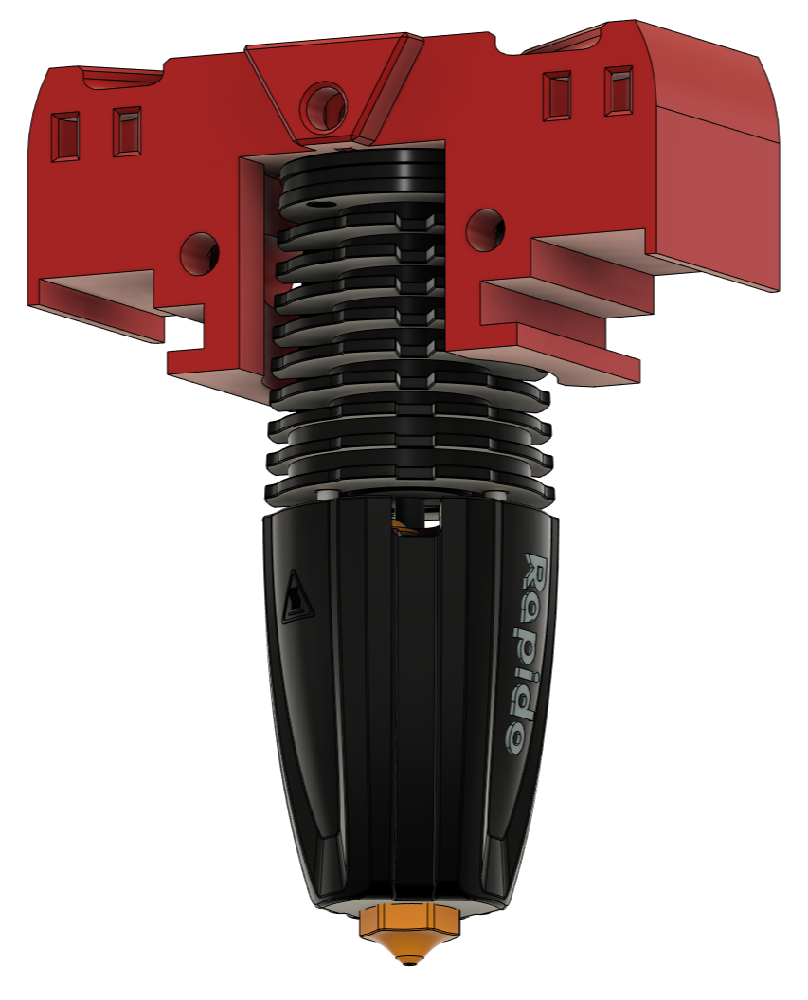

Attach the extruder to the extruder specific mount into the hotend mount:


The hotend mount needs to be mounted to the X Carriage using 2x M3x10mm screws:


Offer the cowl to the hotend mount and from the front use 2 M3x10mm screws to secure the cowl and the hotend mount together:

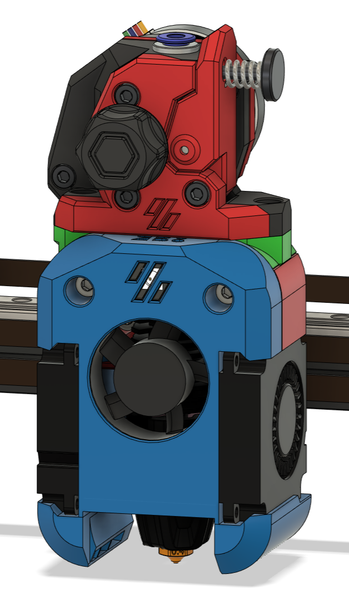

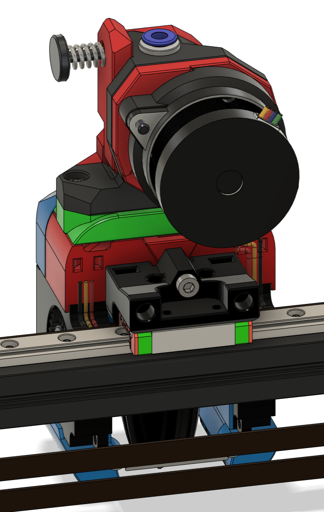

Zip-tie the wires at the back of the assembly.

Be careful not to catch any wires between the surfaces and that when the toolhead moves the X and Y axis endstops are triggered (if using physical X/Y endstops). Also check that the X axis can move completely to the left and right.

Plugin, test the fans and redo your X offset as it will have changed.

## Goliath Air / Water:

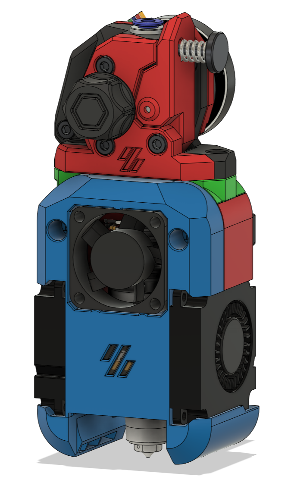

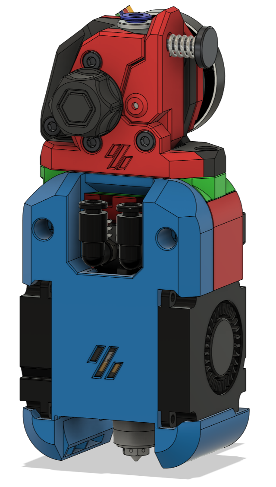

This hotend needs some specific instructions that don't apply to the other hotends supported by Rapid Burner.

To be able to fit the nichrome heater wires need to be bent in a specific way to fit into the restricted space of the cowl. This is how I've done it on the Goliath Air:

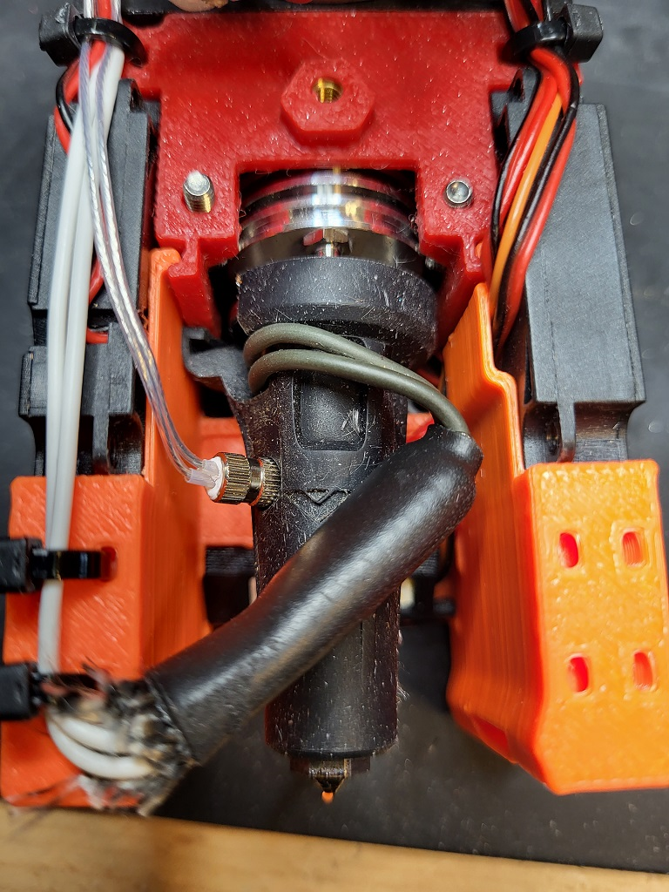

The wires have been twisted around the hotend following their natural angle of twist. They're then twisted back on themselves and the end of the wires coming out of the shrink-wrapper section are attached to the cowl at the lower zip tie.

Twisting the nichrome wires puts stress on them. You should try and avoid twisted them too often as they could break! You have been warned!

Make sure that the nichrome wire does not touch any part of the cowl, otherwise it will likely melt it almost immediately.

Remember to leave space to push the sock onto the heater section.

The Goliath cowls have their own carriages for the logo LED. The nozzle LED's use the standard ones from the standard Rapid Burner.

You will likely need to unscrew the hotend from the heatbreak and rotate it to get the orientation as in the picture above.

You will need to preload the M3 screws into the hotend mount for screwing onto the X carriage before screwing the hotend to the hotend mount, otherwise the screw heads will not be able to pass the hotend to the holes.

## PCB Mounts:

Mounts for various extruders and PCB mounts are [available](https://github.com/chirpy2605/voron/tree/main/general/PCB_Mounts).

## Alternative Mounts:

Mounts are available for [boop](https://github.com/chirpy2605/voron/tree/main/general/Experimental/Boop) as well as the [Large Vorons](https://github.com/chirpy2605/voron/tree/main/general/Large_Voron_Mounts), including mounts for [Tap](https://github.com/chirpy2605/voron/tree/main/general/Large_Voron_Mounts#option-2-tap-probe-front).

## Credits:

- [MapleLeafMakers](https://github.com/MapleLeafMakers) for doing all the work on the Sequin integration

- actualbigbobin (on the Voron Discord) for the original development and inspiration for the Logo LED

- [jlsa1](https://github.com/jlas1/Klicky-Probe/tree/main/Probes) and [MapleLeafMakers](https://github.com/MapleLeafMakers) and for the Integrated Klicky and KlickyNG probe ducts

- Blargedy (on the Voron Discord) for help testing the Goliath Water toolhead

- A big Thank you! to all those who sacrificed many prints and helped to develop v8 in the closed Beta

## v1 Changelog:

- 2022-09-04 First beta release
- 2022-09-21 Fixed ZeroClick cowl
- 2022-09-22 Released bowden mount

## v2 Changelog:

- 2022-11-02 Version 2 release
- 2022-11-29 Hotend Mount geometry fixes
- 2022-11-29 Updated ZeroClick Cowl and Mount

## v3 Release:

- Updated ZeroClick mount

- Added Sherpa Micro extruder support

- Removed LED support to provide better air flow from the part cooling ducts

- Improved geometry of hotend mounts

- Updated ZeroClick cowl to allow ADXL mount on the right side of the toolhead

- Updated all cowls to better hold the 4010 fans

- Moved all hotend mounts to place the nozzle 2mm further forward to match the Mini AfterBurner - You will need to recalculate your Y limits to take advantage of this. The change should mean no loss of Y *unless* banging on the door is an issue

- All hotend mounts have the heatsink thermistor functionality

## v3 Changelog:

- 2022-12-13 v3 released
- 2022-12-20 Added Dragon Volcano mounts and cowls
- 2022-12-22 Added improved ADXL mounts (front and side)

## v4 Release:

- New design

- Voron v0.2 support

- Improved cable routing space

- Additional M2x10mm self tapping screws to hold the 4010 fans in place on some cowl variants

- Improved rigidity of the toolhead

- Improved ZeroClick support

- Improved mounting screw depth

- Where possible, moved the heat inserts to opposing plastic for better screw retention

- Adding bridge cutters where needed

- Removed side-mount ADXL mount in favour of the v0.2 mount on the back of the X carriage

## v4 Changelog:

- 2023-01-23 v4 released

- 2023-01-27 Added sliders to the v0.2 cowls and hotend mounts to help prevent the toolhead from tilting

- 2023-01-27 Added experimental sequin support for v0.2 cowls

- 2023-02-26 Added missing heat insert hole to the orbiter v2 volcano mount

- 2023-02-26 Made all the v0.2 extruder mounts flush with the x-carriage rear screw mount

- 2023-02-26 Added new cable routing system that allows the easy fitting and removal of part cooling fans and simple routing for LEDs

- 2023-02-26 Added Neopixel cowls

- 2023-02-26 Added Sequin cowls

- 2023-02-26 Updated CAD with all the recent changes

- 2023-02-26 Changed LED configuration recommendation to [GitHub - julianschill/klipper-led_effect: LED effects plugin for klipper](https://github.com/julianschill/klipper-led_effect)

- 2023-03-07 Added from mounting ADXL mount plate

## Release v5:

With this release you will need to print a cowl, a hotend mount and an extruder mount

- v0.2 X Carriage only support going forwards
- Added Logo LED support for Neopixel, Sequin or RainbowBarf
- Nozzle LEDs no longer experimental
- Widened the SlideSwipe magnets holes slightly to help prevent printed part splitting when inserting the magnets
- Added experimental Goliath Air and Water hotend support

## v5 Changelog:

- 2023-03-23 v5 released
- 2023-04-02 Separated the LED housing from the cowl to create holders for sequins or neopixels to make it easier to install the LEDs and reduces the number of cowls that need to be published

## Release v6:

- Improved printability of the top front corners of the cowl

- Added support for [Lab4450]([Shop - RGB Neopixel Sequins for Voron Mini SB - Lab4450.com](https://lab4450.com/product/rgb-neopixel-sequins/)) Neopixel Sequins

- Added part cooling fan guides to better seat the fan against the ducts

- Removed the need for part cooling fan screws

- Removed part cooling fan screw nubs to support a wider range of 4010 blowers

- New ducts that are wider to help prevent melting when using v6 type heater blocks (e.g. Dragon hotends)

- New ducts with improved airflow and concentration

- Improved Neopixel fitting with cable routing cutout

- Various cowl geometry fixes

- Confirmed support for the Vz-HextrudORT extruder (uses the LGX Lite extruder mount)

- Improved geometry for the Goliath Air cowl

- Added a 2015 hotend fan adapter

## v6 Changelog:

- 2023-04-29 v6 released
- 2023-05-09 New Goliath Air and Water updates to the cowls, hotend mounts and LED carriages
- 2023-05-09 Goliath Air and Water ADXL carrier added
- 2023-05-09 Goliath Air and Water ADXL additional instructions added
- 2023-05-09 Updated CAD added
- 2023-05-26 Added extruder support for Double Folded Ascender
- 2023 06-23 Added integrated Klicky probe cowls
- 2023 06-23 Added KlickyNG probe cowls

## Release v7

- New aesthetic for the toolhead

- Exclusively supports the Dragon and Rapido UHF hotends (Goliath updates from v6 will follow).

- Volcano sized hotends are now supported by the Dragon Burner toolhead

- Hotend moved back by 2mm to be closer to the stock toolhead position

- All new fan ducts. Size increase by 60% and tuned with CFD to improve part cooling

- 3010 hotend fan placed inside of the cowl

- Improved Bowden mount that uses ECAS 4mm PTFE retainer and improved strain relief

- Removed the 4010 retainer lug on the cowl and lengthened to retaining guides to hole those fans in place

- Updated the KlickyNG cowl orientation

- Modified the ZeroClick cowl to have an integrated mount and include replacement shorter Z rail stops

- Modified SlideSwipe cowl to have matching ducts

- Added fan air redirection fins to all cowls to help with hotend cooling

- Added shortened rail stops for ZeroClick cowl

## v7 Changelog:

- 2023-07-08 v7 released
- 2023-08-06 v7 Goliath Air and Water toolheads updated and released from BETA
- 2023-08-23 Uploaded fixed hotend mounts for the Sherpa Micro, Orbiter v1.4 and Orbiter v2
- 2023-09-13 Updated Goliath hotend mounts to fix rear mount point dimensions

## Release v8 BETA:

- New CFD tuned ducts - significant improvement in part cooling! See [CFD](cfd/)

- Modified the rear duct inner faces to improve overhang printability

- Rear lower brace to improve rigidity

- Cable duct through top of hotend mounts for logo led (except Sherpa Micro)

- Added fillets to inner sides of the cowl to help with front splitting from sides when inserting HE fan

- Modified nut hole to better support using square nuts for toolhead mount through rear of X carriage

- Extruder mounts modified to flow into extruder design where needed

- Added G2SA support (Sherpa Mini and Orbiter v2 mounts)

- New NeoPixel mount (backwards compatible)

- New Sequin mount (backwards compatible)

- Added a NeoPixel soldering jig to aid wiring

- Added a Sequin soldering jig to aid wiring

- Modified the ZeroClick mounts for better magnet retention

- Fix for Rapid Burner 3010 fan fitment issues

- Added v6 Volcano hotend support

- 4010 Fans lowered to the same height as Dragon Burner for a shorter duct length

- Added cat ear cowls

## v8 Changelog:

- 2023-10-14 v8 BETA released
- 2023-10-14 Modified 2510 hotend fan spacer
- 2023-10-18 Added heat inserts to the rear of the ducts on the NoProbe cowls
- 2023-10-29 Added heat inserts to the rear of the ducts on the most cowls (not ZeroClick)
- 2023-10-31 Added note regarding HoneyBadger fans together with klipper workaround. Thanks to PiotrK for supplying the information for this
