# Stove Pipe - a CPAP fan implementation for the Voron v0.1

A CPAP fan implementation for the Voron v0.1

It uses the standard Voron X carriage. There's no loss in X or Z, and at most 3mm in Y, though the rake of the tall duct minimises this.

[](https://youtu.be/9vlZQuW5ikA)

## Background:

CPAP fans not only have a high CFM, they generally also have very high static pressure. This allows air to be delivered to the hotend with greater force than traditional blower fans.

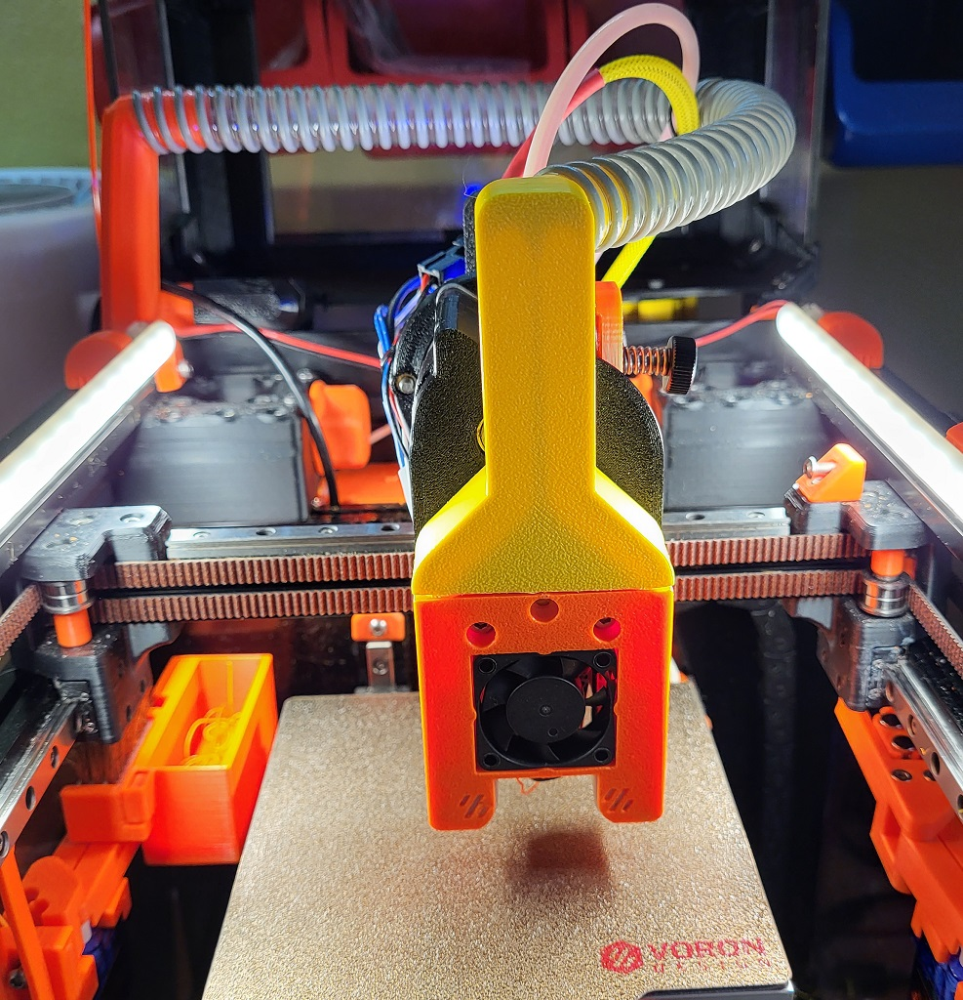

This mod uses the WS7040-24-V200 from [Wonsmart](https://www.wonsmart.com.cn/ws7040-24-v200-15655816895217949.html) which needs to be sourced with a supported [driver board](https://www.wonsmart.com.cn/ws2403-15655936300127195.html). This allows the fan to run at 24v, but the fans PWM is controlled by a 5v data logic controller.

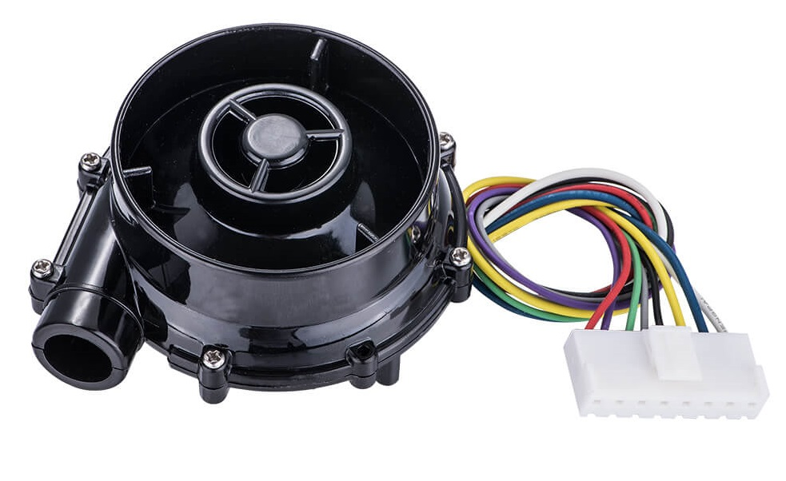
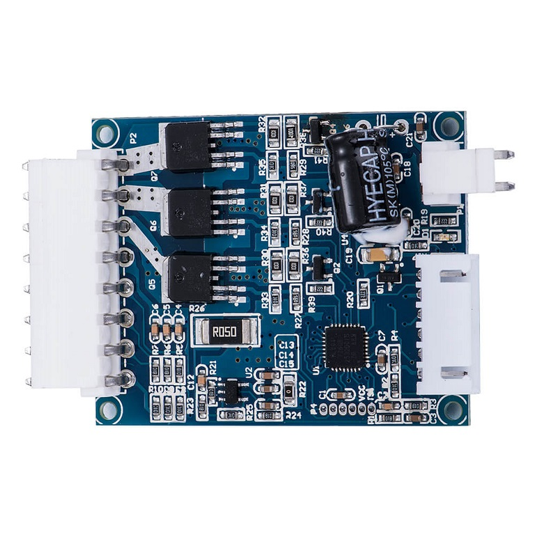

It can also be controlled by a 3.3V  data logic controller such as the printers MCU, but you will usually be limited to ~60% of the fans potential. To increase this you can use a logic level converter to translate the 3.3v data signal to 5v.

This can be achieved in various ways, e.g. using an MCU's neopixel port since they must be driven by 5v data logic. Alternatively, a dedicated logic level converter can be connected to a spare port on the raspberry PI, such as the [Sparkfun BOB-12009](https://www.sparkfun.com/products/12009) which works very well.

The main disadvantage of only using a logic level shifter is that the fan will run at 100% when power is first fed to the PI pin as it floats before being explicitly set. This can be countered by powering the fan itself through a spare heater port on the MCU which you may have free and using it as an enable pin in klipper.

As a simple solution that addresses all of these requirements and concerns, I'm using the [Klipper Expander](https://github.com/VoronDesign/Voron-Hardware/tree/master/Klipper_Expander). The advantages with this solution is that you can control the fan through the Neopixel pin (only 1 wire needed) and explicitly power the fan on/off through one of the 24v MOSFETs. This is important because traditional 24v MCU fan headers won't usually support the 2.8A that this fan can pull at 100% load which can lead to a damaged MCU. 

Fitting all this on a Voron v0.1 introduces its own challenges due to the very limited amount of space available to route the required CPAP pipe. For this reason, this implementation works optimally with a 15mm ID CPAP hose such as [this one](https://www.amazon.co.uk/gp/product/B07TCC42WT) that I have used. They can also be found on Aliexpress, but I haven't tested any of them.

The simplest way to purchase the WS7040 fan is through [Mellow on Aliexpress](https://www.aliexpress.com/item/1005004729010078.html) as this comes together with the required driver board and at the correct voltage. [Trianglelab](https://www.aliexpress.com/item/1005003822117604.html) also have a complete kit, however the included CPAP hose is not 15mm ID and won't work directly with this implementation. There are many other sellers for the WS7040 at widely varying prices. Just be sure to get the correct model (WS7040-24-V200) together with the associated [driver board](https://www.wonsmart.com.cn/ws2403-15655936300127195.html).

This mod also provides a mechanism to switch the air intake from internal to external supply. Internal creates a closed loop heating environment for filaments such as ABS and helps circulate the air, increasing chamber temps. The external intake brings cooler air from outside into the printer for printing filaments such as PLA or PETG, though it's still recommended to keep the door open when doing so.

As a backup, you can also use a modified [MailBox Toolhead](https://github.com/waytotheweb/voron/blob/main/V0/5015_Toolhead) duct on the toolhead shroud and a 5015 fan! This can be swapped out without having to dismantle the toolhead.

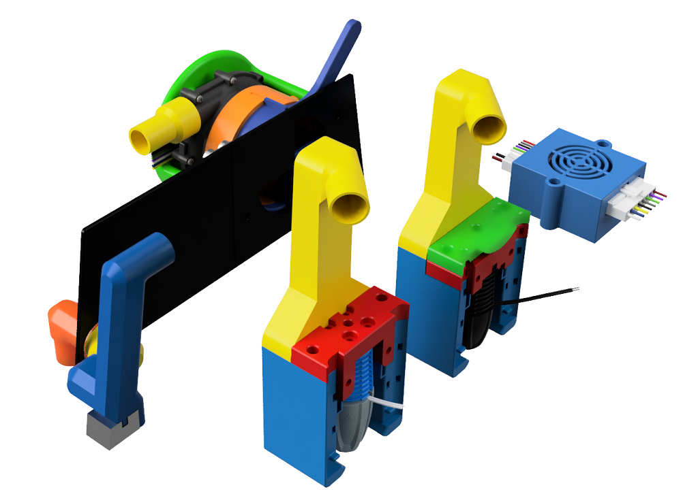

## BOM:

- 6-8x Brass heat inserts (for mounting the fan shroud, shutter, cage and the split Tophat back panel if used)

- 7-9x M3x8mm screws (for mounting the fan shroud, shutter, cage, post connector and the split Tophat back panel if used)

- 3x M2.5x8mm screws

- 1x M3x6mm screw

- 1x M3 nut

- 15mm ID flexible CPAP hose e.g. [Mellow](https://www.aliexpress.com/item/1005004861341928.html)

- Wonsmart 24v (WS7040-24-V200) [fan](https://www.wonsmart.com.cn/ws7040-24-v200-15655816895217949.html)

- Wonsmart 24v [driver board](https://www.wonsmart.com.cn/ws2403-15655936300127195.html)

- [Klipper Expander](https://github.com/VoronDesign/Voron-Hardware/tree/master/Klipper_Expander),
  or Logic level shifter e.g. [Sparkfun BOB-12009](https://www.sparkfun.com/products/12009), or the MCU neopixel pin

## Supported Extruders:

- [RoundAbout](https://github.com/waytotheweb/voron/tree/main/general/RoundAbout)

- [RoundHouse](https://github.com/waytotheweb/voron/tree/main/general/RoundHouse)

- LGX Lite

- Orbiter v1.5

- Sherpa Mini

- Sailfin

## Supported Hotends:

- Revo Voron
- Dragon SF/HF
- DragonFly
- Rapido HF / Mellow Crazy Dragon / Dragon UHF (without extender)
- Rapido UHF and Dragon UHF (separate cowl)
- Mellow NF Crazy (/Mozzie)

## Printing:

All parts should be printed with ABS or ASA. See the [Voron Materials Guide](https://docs.vorondesign.com/materials.html) for more information.

All parts are correctly orientated for printing.

Print using the standard Voron slicer settings. For speed, you can get away with 0.25mm layer height and 0.5mm line width depending on how well tuned your printer/slicer is.

The Tophat back panel on the v0.1 needs to be replaced to allow the flow of air into and from the fan. There are 3 options provided:

- Tophat Back Panel Angled Split Left/Right - this allows you to print the panel on a v0.1 and is held together using the Tophat Back Panel Joiner
- Tophat Back Panel Angled - this replaces the BOM panel
- Tophat Back Panel Squared - this is if you're using a tophat similar to my [TipTopHat](https://github.com/VoronDesign/VoronUsers/tree/master/printer_mods/chirpy/TipTophat) that switches the BOM squared panels to the front/back and the angled ones to the sides

Included are various cowls which are identical apart from the type of probe you use (or don't use). There is a backup [MailBox Toolhead](https://github.com/waytotheweb/voron/blob/main/V0/5015_Toolhead) style duct for a 5015 fan if you do not want to use the CPAP fan. This can be swapped out without havening to dismantle the toolhead.

For the rest of the toolhead parts, you will need a hotend mount, an extruder mount, LED Covers, etc from the [MailBox Toolhead](https://github.com/waytotheweb/voron/blob/main/V0/5015_Toolhead).

There are also parts available for the Rapido and Dragon UHF hotends. These have been designed and tested without loss in Z travel. They are in the [STLs/UHF/](STLs/UHF/) directory. The mounting is different for this cowl. The Hotend_Mounts_UHF is attached to the X carriage first, then the Cowl is then attached to Hotend_Mounts_UHF through the extruder mount.

## Assembly:

### Fan Shroud:


Place brass inserts into the 3 legs of the cage. Place a further 3 inserts into the shroud. Fit the fan into the cage and optionally secure the fan to the shroud using 3x M2.5 screws. Then place the shroud over the fan and secure the shroud to the cage using 3x M3x8mm screws. Push the shutter into the shroud aligning the notch on the shutter with the groove at the top of the shroud and ensure free movement of the lever. There are indentations in the shroud which should feel like a gentle click as the lever is pushed the the left/right limits.

Push the Fan Connector onto the outlet of the CPAP fan.

### Tophat Back Panel:

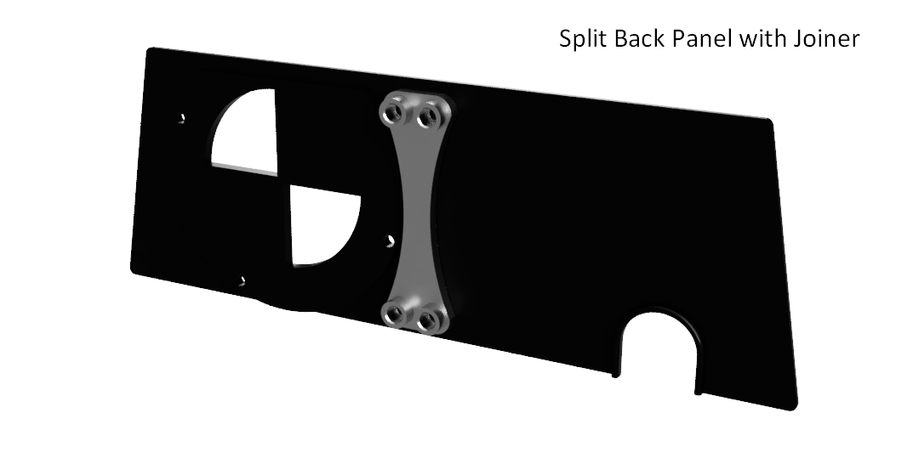

If using the split Tophat back panel, place 4 heat inserts into the Back Panel Joiner. Align the two halves of the Tophat and secure with 4x M3x8mm screws through the panels and into the panel joiner.

Mount the fan assembly to the Tophat back panel using 3x M3x8mm screws.

### Hose Post Connector:


Remove the support material from the bottom of the Post Connector and clean up with a file or sand-paper. Fit the M3 nut into the hole at the inner face at the bottom of the Post Connector.

### Toolhead Ducts:

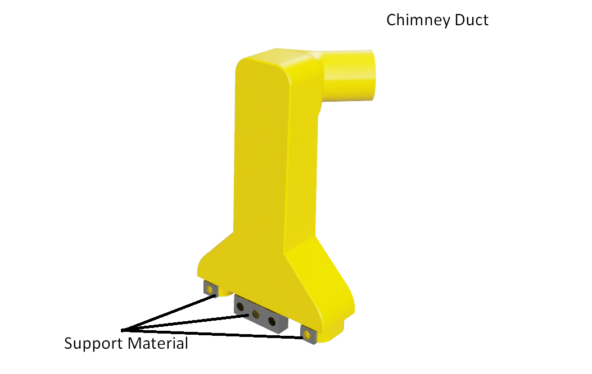

Remove the support material from the bottom of the Chimney. You will need to file/sand the bottom to ensure you have clean surfaces that will slot into the toolhead 

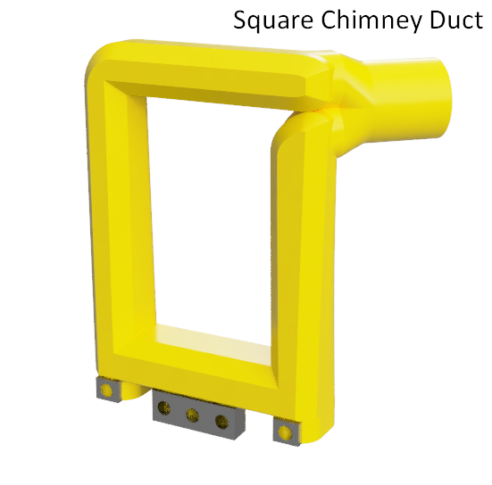

The Square Chimney duct provides space for the Sherpa Mini and Orbiter v1.5 extruders.

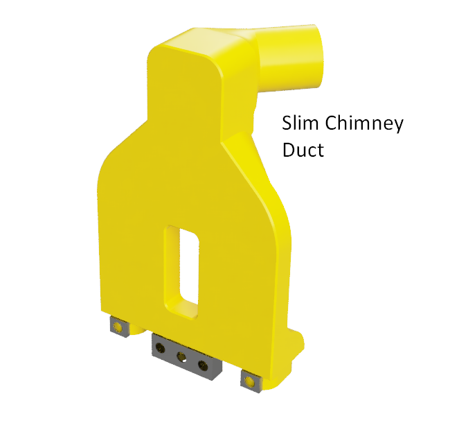

The Slim Chimney duct provides space for the Sailfin extruders. While the air path is not optimal (compared to the standard Chimney Duct), it still provides the benefits of using the CPAP fan.

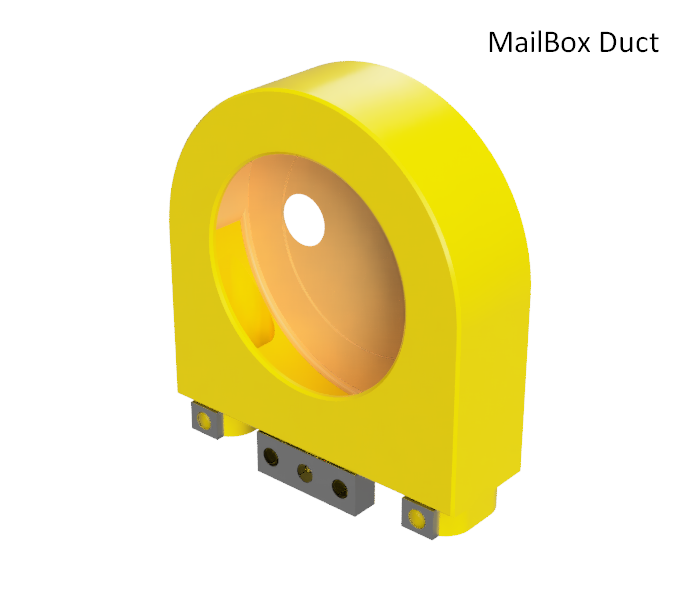

The MailBox duct allows you to use a 5015 fan when not using the CPAP fan if you wish.

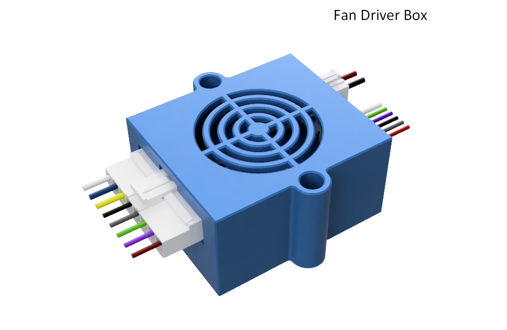

Fan Driver Box.

### Toolhead Cowl:

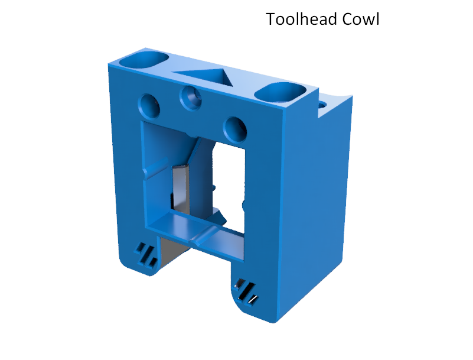

Details for assembling the hotend cowl can be followed in the [MailBox Toolhead](https://github.com/waytotheweb/voron/blob/main/V0/5015_Toolhead) instructions.

Push-fit the Chimney duct into the top of the toolhead cowl, being careful with the air ducts on either side at the front. It should push in tightly. If it's too tight, file/sand the bottom parts of the Chimney ducts until it does fit. If the fit is a little loose, you can secure the duct to the cowl using the M3x6mm screw. Do not overtighten as this is screwing into plastic

## Fitting to the Printer:

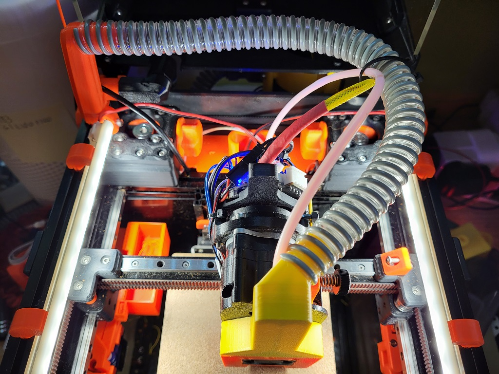

Remove the back panel from the tophat. Replace with the back panel assembly taking care with the lever on the shutter.

If you use the stock tophat locator pins, you will need to remove the one on the back left.

Fit the Post Angle Connector 45 to the bottom outlet on the Post connector, you will need to twist it into place. Push the Post Connector into the top of the left Y extrusion as far back as it will go, then pull forward about 1cm so that the tophat doesn't catch on it. Use an M3x8mm screw to secure the Post Connector to the extrusion.

Fit the Post Connector Angle 90 to the Post Angle Connector 45 so that it goes through the hole in the Tophat Back Panel and faces down.

Connect 25cm of CPAP hose from the Fan Connector to the downward facing Post Connector Angle 90. Check that the Tophat can be easily placed and removed from the printer. If using a hinged Tophat ensure that it opens and closes without fouling the connectors.

Fit the new toolhead to the printer. Connect 30cm of CPAP hose from the Post Connector to the Chimney Duct.  If necessary, twist the CPAP tube a little to ensure that it fits level, not angled down or up (see [top image](https://github.com/waytotheweb/voron_WIP/tree/main/StovePipe#whats-this-then)). Slowly move the toolhead by hand checking that it can reach all corners of travel with the Tophat fitted and that nothing gets caught and the endstops can be triggered.

If the CPAP hose is loose on any of the fittings, use some electrical tape to hold it in place.

Depending on your harness setup you can loosely cable-tie the CPAP hose, printer wiring harness and the PTFE tube together to help ensure nothing gets trapped.

## Wiring:

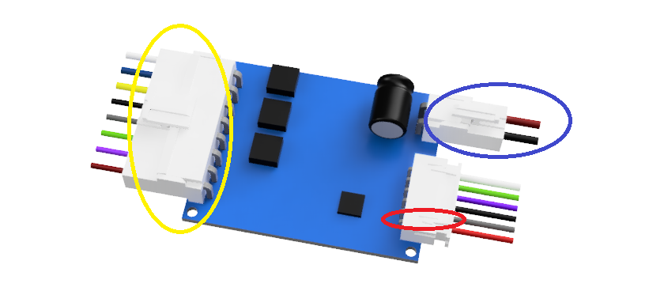


Run a wire from the second from the bottom pin (red circle) on the driver board to the centre neopixel pin (red circle) on the klipper expander.

Connect the 24v connector (blue circle) on the driver board to one of the MOSFET ports (blue circle) on the Klipper Expander, paying attention to the polarity.

Connect the large connector from the fan to the driver board (yellow circle).

Connect your 24v supply (e.g. from the printer PSU) to the Klipper Expander (yellow circle). See the [Klipper Expander](https://github.com/VoronDesign/Voron-Hardware/tree/master/Klipper_Expander/Documentation) documentation on how to connect and configure it to the printer.

## Klipper:

You will need to comment out your existing ```[fan]``` section in your klipper configuration.

This is the configuration I use for the Klipper Expander wired as above:

```
[fan]
pin: expander:PB1        # Neopixel pin
enable_pin: expander:PA0 # Mosfet 0
hardware_pwm: False      # Use software PWM
cycle_time: 0.010
off_below: 0.08          # Minimum speed of 8% - the fan usually stalls any lower
shutdown_speed: 0        # Turn off the fan when klipper shuts down
```

## Tips:

- ABS usually needs 10% fan for normal printing
- PLA can require 100% fan if you're trying to achieve high speed printing, otherwise 30% is usually plenty
- Due to the sudden increase in fan output, your hotend might struggle to maintain temps and klipper will abort prints if it is unable to do so. This can be countered by attempting to PID tune the hotend at the desired fan speed. If that also fails, you will need to look at a more powerful hotend heater. I went through this and ended up using a Rapido hotend which is able to quickly return to the required temperature no matter the fan speed. The Revo Voron should also work similarly
- Remember to change the fan inlet lever. If you leave it closed (i.e. the fan uses external air) and print ABS you will almost always see print warping
- If you find ABS warping with the inlet open (i.e. recycling warm air) then you may need to heat soak the printer for longer to raise the ambient temperature
- You may be able to use a wider ID CPAP hose if you wrap the connectors with tape to increase their OD, this has not been tested
- This mod was designed and tested on a v0.1 with a stock Tophat and a raised Tophat

## Change Log:

- 2022-10-29 WIP Release
- 2022-10-29 Updated the Slim Chimney to offer better support for the Sailfin extruder
- 2022-10-30 Improved image and instructions for the angle connectors
- 2022-10-30 Improved UHF Chimney connector shape to the cowl
- 2022-10-31 Restored the hotend fan through mounts to the UHF cowls
- 2022-10-31 Fully tested the UHF setup
- 2022-11-08 Revised the Chimney ducts to be of equal height and leaves access to the PTFE tube clear
- 2022-11-09 Further improvements to the Chimney duct
- 2022-11-14 Added new Square Chimney duct to use instead of Slim Chimney for Sherpa Mini and Orbiter v1.5
- 2022-11-15 Modified the UHF hotend mount to cater for shorter mounting screws
- 2022-11-15 Updated the Square Chimney duct
- 2022-11-17 Updated Chimney duct to help avoid hitting the stock tophat
- 2022-11-17 Modified the ZeroClick mount to stop it rotating

## Release v1:

- Improved airflow through part cooling ducts

- Doubled the size of the  part cooling duct exits

- Added heatsink thermistor to Rapido/Dragon UHF mount

- Added CAD

## Changelog:

- 2022-12-19 Released v1
