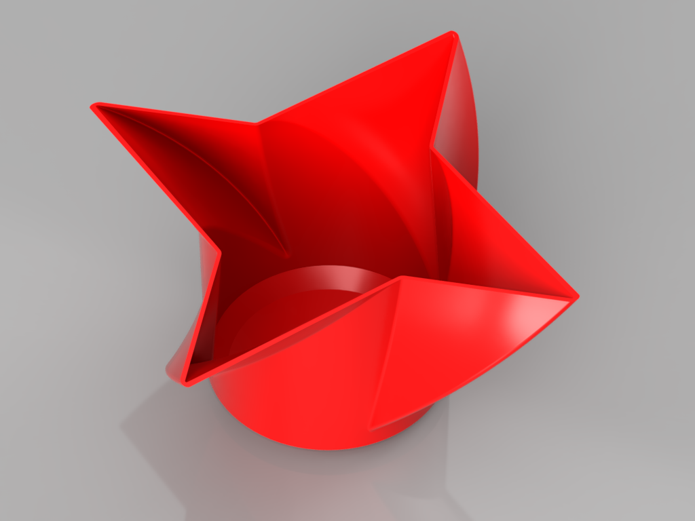

# Testing Fan Ducts

This documents provides a way to perform comparative tests using a standard set of slicer configurations and test parts.

## General Duct Design Suggestions

The positioning of the fan(s) on the toolhead will inform the following list of suggestions:

- The ducts should be as short as possible so the fan outlet is as close to the duct outlet as they can be
- Avoid forcing the airflow to deviate within the duct as this can affect both the velocity and pressure of the airflow within the duct
- Angle the airflow within the duct and duct outlet such that it is directed to the tip of the nozzle. Too high and the airflow will be wasted on the heater block and cause problems for the hotend. Too low and likely affect cooling the filament as it is put down
- Avoid having the airflow from opposing ducts hitting straight on at the nozzle. This causes a high pressure, low velocity zone around the nozzle that reduces the effectiveness of cooling being applied
- The airflow from each duct should be directed to arrive at the nozzle at an angle. This helps to relieve the high pressure and helps cooling by moving the heat away from the nozzle
- Consider airflow to the front and rear of the nozzle so that the sides, the front and the back of the nozzle are cooled, otherwise one or more sides may provide less cooling
- Aim to have the bottom of the fan ducts 1~2mm above the tip of the nozzle to avoid hitting the printed part

## Test Prints

The following are suggested print settings and two test parts to perform comparative tests.

It is important to keep all speed, temperature and other slicer and printer settings the same so that comparisons while testing different duct designs can be made.

There are two test parts available:

- [Shuriken_55.stl](Shuriken_55.stl)

- [Shuriken_85.stl](Shuriken_85.stl)

The difference is the angle of the sweep from the bottom to the top of the test part. When starting testing, use the 55 degree Shuriken to establish the effectiveness of the ducts. Once this part prints cleanly, move on to the 85 degree Shuriken.

The aim is to physically show how well and where cooling affects the printed part. The goal is not necessarily to print perfect test parts, as much as showing improvements during the iterative design process. 

## Suggested Print Settings

The following are suggested settings for printing the test parts. These were made from testing on the Voron v0, Voron Trident and Voron 2.4. They may need adjusting higher or lower depending on the capabilities of the printer:

- use the same ABS or ASA filament for testing

- use the same GCODE for each test print

- 10000 $mm/s^2$ acceleration for all slicer settings

- 500 $mm/s$ speed for all slicer settings

- 0 minimum layer time

- no flow rate restriction

- 2 walls

- no infill

- no top layers

Ensure all chamber temps, print temps, hardware and filament is identical.

## Credits

- This document was written by [chirpy](https://github.com/chirpy2605/voron)

- The parametric Shuriken test print was designed by [kyleisah](https://github.com/kyleisah)

- Testing methodology was established by [bythorsthunder](https://github.com/bythorsthunder) and those mentioned above

- CFD methodology, guidance and documentation provided by [yellowfish543](https://github.com/yellowfish543)
